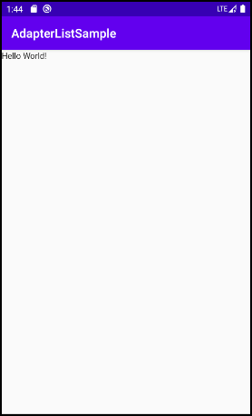
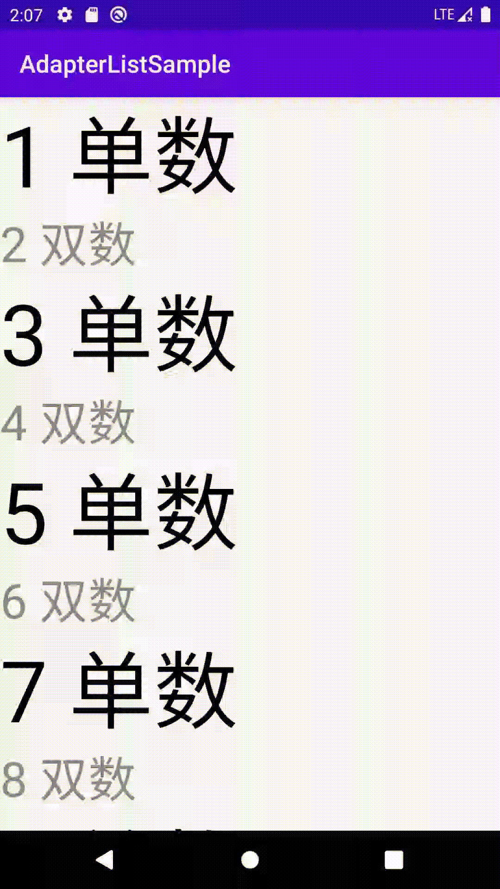

Jetpack Compose 最新惊喜
==========

> 简介

Jetpack Compose是用于构建原生Android界面的新工具包。它基于声明性编程模型，因此只需描述界面的外观（不知道Flutter什么感想），Compose会负责完成其余工作，界面会随着应用状态的变化而自动更新。由于它是基于Kotlin而构建的，因而可与Java编程语言完全互操作，并且可直接访问所有Android API和Jetpack API。它与现有界面工具包兼容，因此您可以混合搭配使用经典视图和新视图，而且它从一开始便支持Material设计和动画。 -- 摘自官网

> 环境安装

使用Jetpack Compose需要Android Studio 4.0 Canary版（最新4.1Canary1）[下载地址](https://developer.android.com/studio/preview/?utm_source=android-studio)

> 设置

环境设置，及包依赖[请参考](https://developer.android.com/jetpack/compose/setup)
Kotlin插件使用1.3.61+即可，无需使用测试版本

##### build.gralde
```
android {
    buildFeatures {
       // Enables Jetpack Compose for this module
       compose true
    }

    // Set both the Java and Kotlin compilers to target Java 8.
    compileOptions {
       sourceCompatibility JavaVersion.VERSION_1_8
       targetCompatibility JavaVersion.VERSION_1_8
    }

    kotlinOptions {
       jvmTarget = "1.8"
    }
}

dependencies {
    implementation 'androidx.ui:ui-tooling:0.1.0-dev05'
    implementation 'androidx.ui:ui-layout:0.1.0-dev05'
    implementation 'androidx.ui:ui-material:0.1.0-dev05'
    implementation 'androidx.ui:ui-foundation:0.1.0-dev05' // AdapterList 需要
}
```

> 上代码

```
class MainActivity : AppCompatActivity() {
    override fun onCreate(savedInstanceState: Bundle?) {
        super.onCreate(savedInstanceState)
//        setContentView(R.layout.activity_main)  // 不用写XML了
        setContent {
            Text("Hello World!")
        }
    }
}
```

运行后如下图：



### AdapterList（重点）

Jetpack Compose发布了“0.1.0-dev05”，也发布了一个名为AdapterList的新组件。我们重点就来看看它吧。
AdapterList是一个只对当前可见项进行组合和布局的列表。这类似于RecyclerView所做的，使用AdapterList非常简单，我们只需几行代码就可以创建一个列表。

> 我们先来看下它的源码

```
@Composable
fun <T> AdapterList(
    data: List<T>,
    modifier: Modifier = Modifier.None,
    itemCallback: @Composable() (T) -> Unit
)
```

* 第一个参数数据是一个通用列表，表示将要显示的项列表。
* 第二个修饰符默认值为modifier，无修饰符，可以根据自己的用例添加自己的修饰符。
* 最后一个参数itemCallback是从数据参数发出项的回调，我们可以使用它为每个发出的项创建UI。这些项目一个接一个地垂直堆叠。因此，如果希望列表中的某些元素具有与其他元素不同的UI，只需添加if或when条件并更改该特定项的UI即可。目前已知的一个问题是AdapterList只支持垂直列表。

> 随后将代码调整下先前代码

```
class MainActivity : AppCompatActivity() {
    override fun onCreate(savedInstanceState: Bundle?) {
        super.onCreate(savedInstanceState)
//        setContentView(R.layout.activity_main)
        setContent {
//            Text("Hello World!")
            AdapterList(
                data = (1..20).map { it }.toList()
            ) {
                if (it % 2 == 0) {
                    Text("$it 双数", style = TextStyle(fontSize = 40.sp, color = Color.Red))
                } else {
                    Text(text = "$it 单数", style = TextStyle(fontSize = 70.sp))
                }
            }
        }
    }
}
```

在上面的例子中，可以看到传递的是一个整数列表，在lambda中，根据需要操作UI。上面代码片段的输出在下面的GIF中给出。



我相信到现在大家一定已经意识到用AdapterList在Jetpack Compose中创建一个类似RecyclerView的列表是多么容易。如果您尝试使用RecyclerView来实现相同的结果，那么您就知道还需要编写多少代码。
