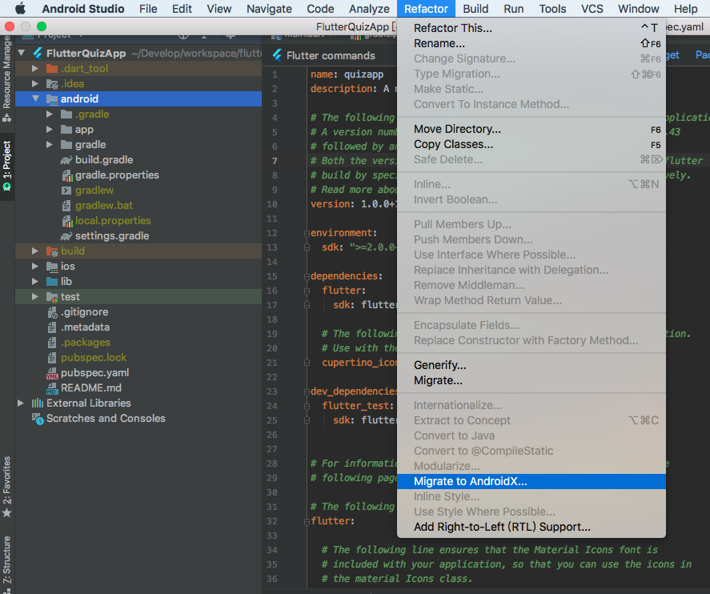
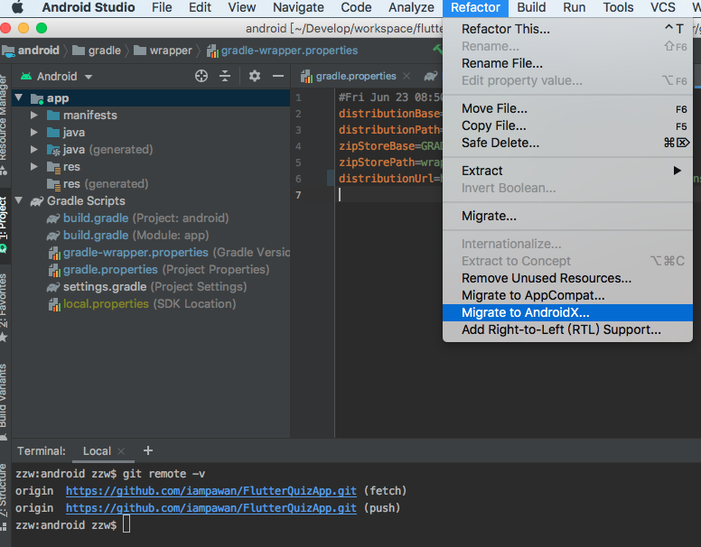
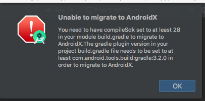
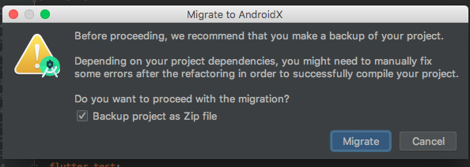
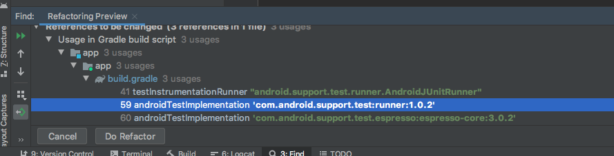

如何快速的将已有的Flutter Android项目迁移到androidx
====

### 开场白

最近一直在折腾Flutter命令，版本切换，整理了下原有的Demo。因为flutter已经更新到了`1.12.13+hotfix.9`。这个版本（1.12.13）默认创建项目就开启了androidx的支持。当我编译到之前的一个demo的时候，出现了这样一句提示: `[!] Your app isn't using AndroidX.`。故此有了这篇博文。

```
zzw:FlutterQuizApp zzw$ flutter build apk
Running "flutter pub get" in FlutterQuizApp...                      1.0s
You are building a fat APK that includes binaries for android-arm, android-arm64, android-x64.
If you are deploying the app to the Play Store, it's recommended to use app bundles or split the APK to reduce the APK size.
    To generate an app bundle, run:
        flutter build appbundle --target-platform android-arm,android-arm64,android-x64
        Learn more on: https://developer.android.com/guide/app-bundle
    To split the APKs per ABI, run:
        flutter build apk --target-platform android-arm,android-arm64,android-x64 --split-per-abi
        Learn more on:  https://developer.android.com/studio/build/configure-apk-splits#configure-abi-split
[!] Your app isn't using AndroidX.
```

### 开始

1. 使用AndroidStudio打开项目

    转化需要`AndroidStudio 3.2+`才支持,没有升级的请自行[下载升级](https://developer.android.com/studio)

    

    不要以flutter项目结构打开项目，如上图，同样包含了`Migrate to AndroidX`按钮，但是可能会不起作用。

    <font color=red>应以android目录打开已有项目，如下图：</font><br>

    

2. 修改版本

    直接点击`Migrate to AndroidX`按钮后会提示

    

    其实因为androidx最低版本支持要求如下：

    * compileSDK 不低于28
    * adnroid gradle plugin 不低于3.2.0
    * gralde 不低于4.6

    修改所有版本后，gradle sync一下等待所有依赖下载结束。

3. 迁移

    点击`Migrate to AndroidX`按钮之后会显示如下信息：

    

    选择`Backup project as Zip file`，以防止抽风，其实git管理的不需要也罢，可以直接跳过。继续，稍稍一会就回出现

    

    将依赖转化为androidx包，直接点击`Do Refactor`即可。

4. 迁移完成。

    再次使用AndroidStudio打开Flutter项目，或者直接命令行运行。


### 示例来源

```
https://github.com/iampawan/FlutterQuizApp.git
```
