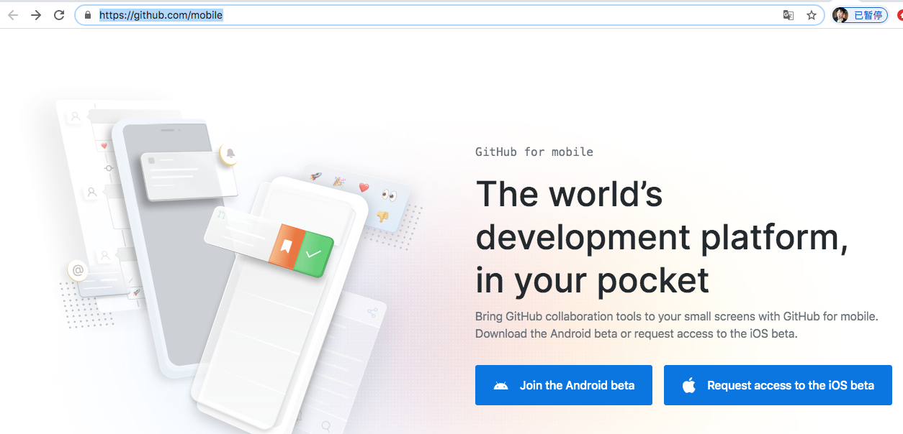

GitHub官方客户端测试版试用
========

### 目前的主要功能有：

1. 查看通知

2. 新的收件箱（网页版处于测试中的那个）

3. 审查并评论代码

4. 查看并合并代码

### 如何下载

* Android [Google商店](https://play.google.com/store/apps/details?id=com.github.android)下载试用

* IOS 进入[官网](https://github.com/mobile)提交申请等待

