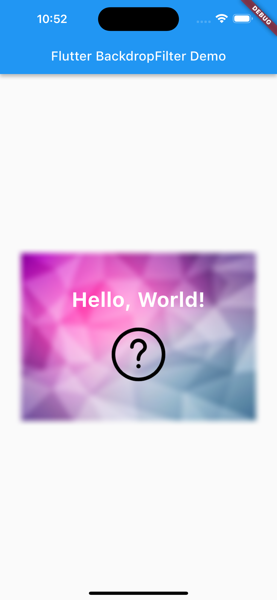

Flutter BackdropFilter解析
=========

它是Flutter框架中的一个特殊的Widget，它可以用于创建一个模糊的背景，使得前景内容更加突出。在这篇文章中，我们将会探讨Flutter BackdropFilter的作用、参数以及如何使用它。

### 什么是BackdropFilter?

BackdropFilter是一个widget，它可以用于创建一个模糊的背景。它通常用于创建一个视觉上的深度效果，使得前景内容更加突出。BackdropFilter可以与其他widget结合使用，从而创建出非常独特的UI效果。

### 它的作用
BackdropFilter的作用是创建一个模糊的背景，使得前景内容更加突出。它可以用于创建各种各样的UI效果，比如模糊背景下的文本、图片等。BackdropFilter还可以与其他widget结合使用，从而创建出非常独特的UI效果。

### BackdropFilter有哪些参数
BackdropFilter有两个必选参数和一个可选参数。下面是每个参数的功能和作用：

- child：要显示在模糊背景上的widget。
- filter：要应用于child的滤镜。
- blendMode（可选）：要应用于child和背景之间混合模式。

### 按照应用场景举例说明如何使用它
假设我们要在一个页面上显示一张图片和一段文本，并且想要创建一个模糊的背景来突出显示这些内容。我们可以使用如下代码：

``` dart
import 'dart:ui' as ui;

import 'package:flutter/material.dart';

void main() {
  runApp(MyApp());
}

class MyApp extends StatelessWidget {
  @override
  Widget build(BuildContext context) {
    return MaterialApp(
      home: Scaffold(
        appBar: AppBar(
          title: Text('Flutter BackdropFilter Demo'),
        ),
        body: Stack(
          children: [
            Positioned.fill(child: Image.asset("assets/images/background.jpg")),
            Positioned.fill(
              child: BackdropFilter(
                filter: ui.ImageFilter.blur(sigmaX: 5.0, sigmaY: 5.0,),
                  child: Container(color: Colors.black.withOpacity(0),),
              ),
            ),
            Positioned.fill(child: Column(
              mainAxisAlignment: MainAxisAlignment.center,
              children: [
                Text(
                  'Hello, World!',
                  style: TextStyle(
                    fontSize: 32,
                    color: Colors.white,
                    fontWeight: FontWeight.bold,
                  ),
                ),
                SizedBox(height: 16),
                Image.asset('assets/images/logo.png', width: 100),
              ],
            )),
          ],
        ),
      ),
    );
  }
```

运行效果如下：



在这个例子中，我们使用BackdropFilter来创建一个模糊的背景，使用了ImageFilter.blur来指定模糊程度，并且使用了Image.asset来设置背景图片。最后，我们将文本和图片放在了一个Column中，并将它们居中显示。

## 总结
BackdropFilter是一个非常有用的widget，它可以用于创建各种各样的UI效果。通过设置不同的滤镜和混合模式，我们可以创建出非常独特的UI效果。如果你正在开发一个Flutter应用程序，并且想要添加一些视觉上的深度效果，那么BackdropFilter绝对值得一试。