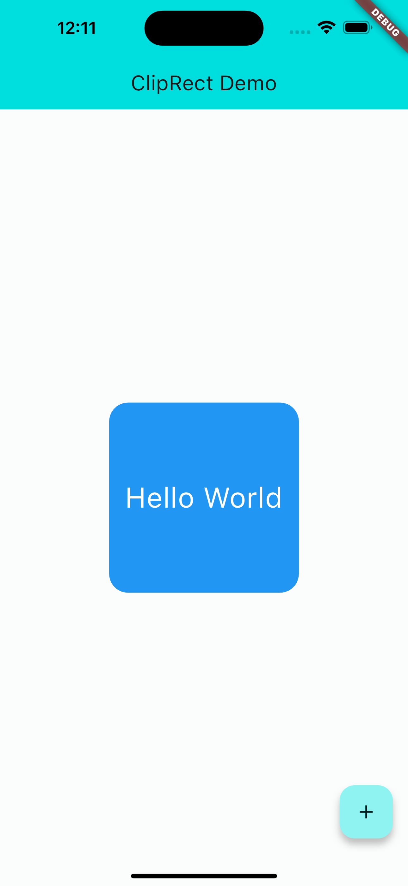
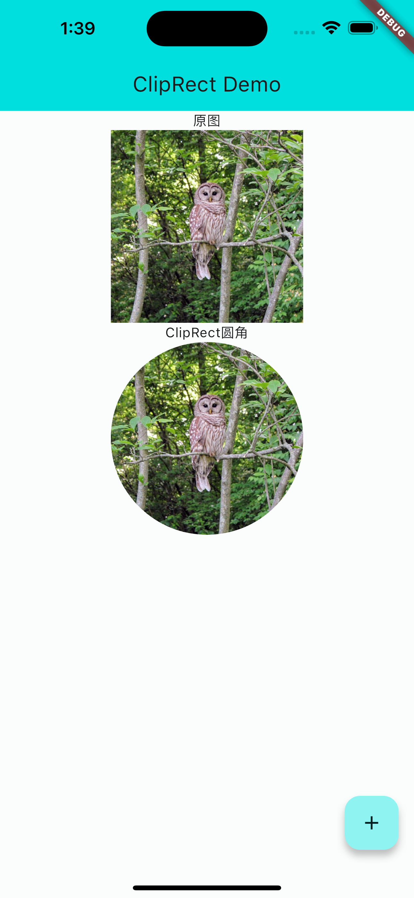

Flutter ClipRect详解
======
ClipRect是Flutter中的一个Widget，用于限制子Widget的绘制区域，它可以让我们在一个矩形区域内绘制子Widget，而超出这个矩形区域的部分将不会被显示出来。在本篇文章中，我们将详细介绍ClipRect的使用方法和注意事项。


### 什么是ClipRect？

ClipRect是Flutter中的一个Widget，用于限制子Widget的绘制区域，它可以让我们在一个矩形区域内绘制子Widget，而超出这个矩形区域的部分将不会被显示出来。ClipRect通常用于实现一些特殊的效果，比如圆角矩形、圆形头像等。此外，ClipRect还可以与其他小部件结合使用，例如Opacity、Transform等，实现更加丰富的效果。


### 包含了哪些参数？

- clipper：自定义裁剪路径的Clipper对象。
- clipBehavior：裁剪行为，默认为Clip.antiAlias。
- child：要裁剪的子部件。
- key：小部件的唯一标识符。


ClipRect有两个必选参数：child和clipper。其中child参数是要进行裁剪的子Widget，clipper参数是一个CustomClipper对象，用于指定裁剪区域的形状和位置。此外，ClipRect还有一个可选参数clipBehavior，用于指定当裁剪区域超出子Widget范围时的处理方式。
其中，clipper参数是可选的，如果不传入clipper对象，则ClipRect默认使用矩形裁剪。clipBehavior参数用于指定裁剪行为，例如是否抗锯齿等。child参数是必须的，它指定了要裁剪的子部件。key参数用于唯一标识小部件。


### 区别于Container？

Container也可以用于限制子Widget的绘制区域，但它的主要作用是布局和装饰，而不是裁剪。与ClipRect不同，Container可以设置padding、margin、背景色、边框等属性，而ClipRect只能设置裁剪区域的形状和位置。

### 如何使用它

下面我们来看一个例子，展示如何使用ClipRect实现圆角矩形裁剪效果：

```
ClipRect(
  child: Container(
    width: 200,
    height: 200,
    decoration: BoxDecoration(
      color: Colors.blue,
      borderRadius: BorderRadius.circular(20),
    ),
    alignment: Alignment.center,
    child: Text(
      'Hello World',
      style: TextStyle(
        color: Colors.white,
        fontSize: 30,
      ),
    ),
  ),
)
```




在上面的例子中，我们首先创建一个Container小部件，并设置其宽度和高度为200。然后，我们使用BoxDecoration对象设置Container的背景颜色为蓝色，并设置其圆角半径为20。最后，我们将Container作为ClipRect的子部件，并将其裁剪为圆角矩形。


它的原理是通过Canvas的裁剪功能，将子Widget绘制区域限制在指定的矩形范围内，从而实现只显示指定区域的效果。

下面是一个简单的例子，展示如何使用ClipRect将一个图片裁剪为圆形：

```
ClipRect(
  child: Container(
    width: 200,
    height: 200,
    decoration: BoxDecoration(
      shape: BoxShape.circle,
      image: DecorationImage(
        image: AssetImage('assets/images/avatar.png'),
      ),
    ),
  ),
)
```



在这个例子中，我们使用了ClipRect将一个Container裁剪为圆形，并在其中显示了一张图片。当图片超出圆形区域时，它会被自动裁剪掉，从而实现了只显示圆形区域的效果。


clipper参数是一个CustomClipper对象，它定义了裁剪区域的形状和位置。Flutter提供了几个内置的CustomClipper对象，比如ClipRRect、ClipOval、ClipPath等。下面我们将分别介绍它们的用法。

> ClipRRect

ClipRRect可以将子Widget裁剪为圆角矩形。它有两个必选参数：borderRadius和child。其中borderRadius是一个BorderRadius对象，用于指定圆角的大小和位置；child是要进行裁剪的子Widget。

示例代码：

```dart
ClipRRect(
  borderRadius: BorderRadius.circular(10.0),
  child: Image.asset('images/avatar.png'),
)
```

> ClipOval

ClipOval可以将子Widget裁剪为圆形。它只有一个必选参数child，用于指定要进行裁剪的子Widget。

示例代码：

```
ClipOval(
child: Image.asset('images/avatar.png'),
)
```

> ClipPath

ClipPath可以将子Widget裁剪为任意形状。它有两个必选参数：clipper和child。其中clipper是一个CustomClipper<Path>对象，用于指定裁剪区域的路径；child是要进行裁剪的子Widget。

示例代码：

```
class TriangleClipper extends CustomClipper<Path> {
@override
Path getClip(Size size) {
Path path = Path();
path.moveTo(size.width / 2, 0);
path.lineTo(size.width, size.height);
path.lineTo(0, size.height);
path.close();
return path;
}

@override
bool shouldReclip(CustomClipper<Path> oldClipper) => false;
}

ClipPath(
clipper: TriangleClipper(),
child: Image.asset('images/avatar.png'),
)
```


### 自定义clipper

除了内置的CustomClipper对象之外，我们还可以自定义CustomClipper对象来实现更加灵活的裁剪效果。下面我们将分别介绍几种自定义CustomClipper对象的用法。

> CustomClipperRect

CustomClipperRect可以将子Widget裁剪为矩形。它只有一个必选参数child，用于指定要进行裁剪的子Widget。

示例代码：
```
class MyClipper extends CustomClipper<Rect> {
@override
Rect getClip(Size size) {
return Rect.fromLTWH(0, 0, size.width / 2, size.height);
}

@override
bool shouldReclip(CustomClipper<Rect> oldClipper) => false;
}

ClipRect(
clipper: MyClipper(),
child: Image.asset('images/avatar.png'),
)
```

> CustomClipperRRect

CustomClipperRRect可以将子Widget裁剪为圆角矩形。它有两个必选参数：borderRadius和child。其中borderRadius是一个BorderRadius对象，用于指定圆角的大小和位置；child是要进行裁剪的子Widget。

示例代码：

```
class MyClipper extends CustomClipper<RRect> {
@override
RRect getClip(Size size) {
return RRect.fromLTRBR(0, 0, size.width / 2, size.height, Radius.circular(10.0));
}

@override
bool shouldReclip(CustomClipper<RRect> oldClipper) => false;
}

ClipRRect(
clipper: MyClipper(),
child: Image.asset('images/avatar.png'),
)
```

> CustomClipperPath

CustomClipperPath可以将子Widget裁剪为任意形状。它有两个必选参数：clipPath和child。其中clipPath是一个Path对象，用于指定裁剪区域的路径；child是要进行裁剪的子Widget。

示例代码：

```
class MyClipper extends CustomClipper<Path> {
@override
Path getClip(Size size) {
Path path = Path();
path.moveTo(size.width / 2, 0);
path.lineTo(size.width, size.height);
path.lineTo(0, size.height);
path.close();
return path;
}

@override
bool shouldReclip(CustomClipper<Path> oldClipper) => false;
}

ClipPath(
clipper: MyClipper(),
child: Image.asset('images/avatar.png'),
)
```

### 参数clipBehavior的使用导致的效果

clipBehavior参数用于指定当裁剪区域超出子Widget范围时的处理方式。它有三个可选值：Clip.none、Clip.hardEdge和Clip.antiAlias。
在实际开发中，我们可以根据具体需求选择不同的clipBehavior值来实现不同的效果。下面我们将分别举例说明每个值的效果。

> Clip.none

当clipBehavior设置为Clip.none时，超出裁剪区域范围的部分会被显示出来。比如下面这个例子，我们将一个圆形头像放在一个正方形容器中，并将容器向右移动了一段距离。由于clipBehavior设置为none，因此头像右侧超出容器范围的部分依然可以显示出来。

示例代码：
```
Container(
    width: 100,
    height: 100,
    color: Colors.grey,
    margin: EdgeInsets.only(left: 50),
    child: ClipOval(
    clipBehavior: Clip.none,
    child: Image.asset('images/avatar.png'),
    ),
)
```

> Clip.hardEdge

当clipBehavior设置为Clip.hardEdge时，超出裁剪区域范围的部分会被硬边缘裁剪掉。比如下面这个例子，我们将一个圆形头像放在一个正方形容器中，并将容器向右移动了一段距离。由于clipBehavior设置为hardEdge，因此头像右侧超出容器范围的部分会被硬边缘裁剪掉。

示例代码：

```
Container(
    width: 100,
    height: 100,
    color: Colors.grey,
    margin: EdgeInsets.only(left: 50),
    child: ClipOval(
    clipBehavior: Clip.hardEdge,
    child: Image.asset('images/avatar.png'),
    ),
)
```

> Clip.antiAlias

当clipBehavior设置为Clip.antiAlias时，超出裁剪区域范围的部分会被平滑边缘裁剪掉。比如下面这个例子，我们将一个圆形头像放在一个正方形容器中，并将容器向右移动了一段距离。由于clipBehavior设置为antiAlias，因此头像右侧超出容器范围的部分会被平滑边缘裁剪掉。

示例代码：

```
Container(
    width: 100,
    height: 100,
    color: Colors.grey,
    margin: EdgeInsets.only(left: 50),
    child: ClipOval(
    clipBehavior: Clip.antiAlias,
    child: Image.asset('images/avatar.png'),
    ),
)
```

### 总结
通过本篇文章的介绍，我们了解了Flutter中ClipRect小部件的定义、作用、参数以及如何使用它。ClipRect是一个非常有用的小部件，它可以让你轻松实现各种形状的裁剪效果。在实际开发中，你可以根据需要选择不同的裁剪方式，并结合其他小部件实现更加丰富的效果。希望读者能够通过本文掌握基本的使用技巧，并在实际开发中灵活应用。

