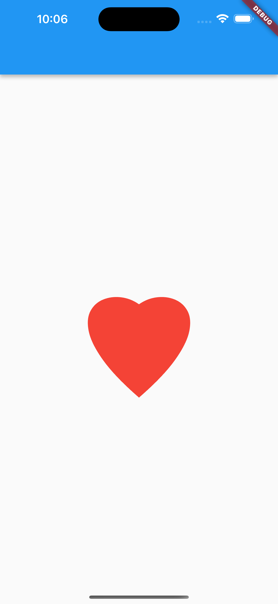
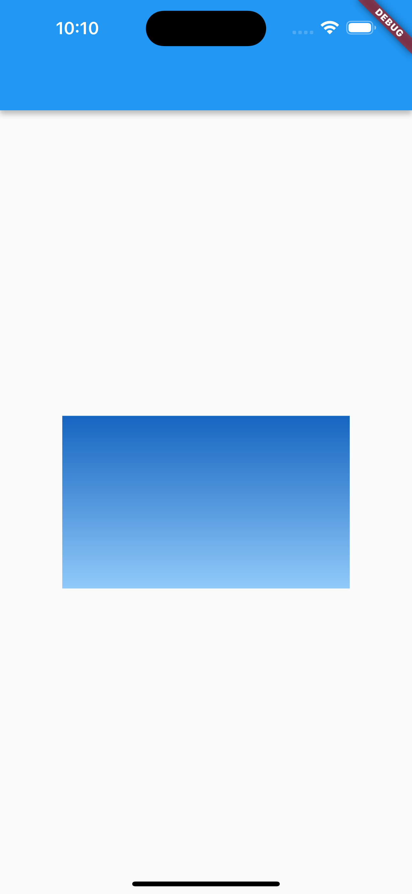
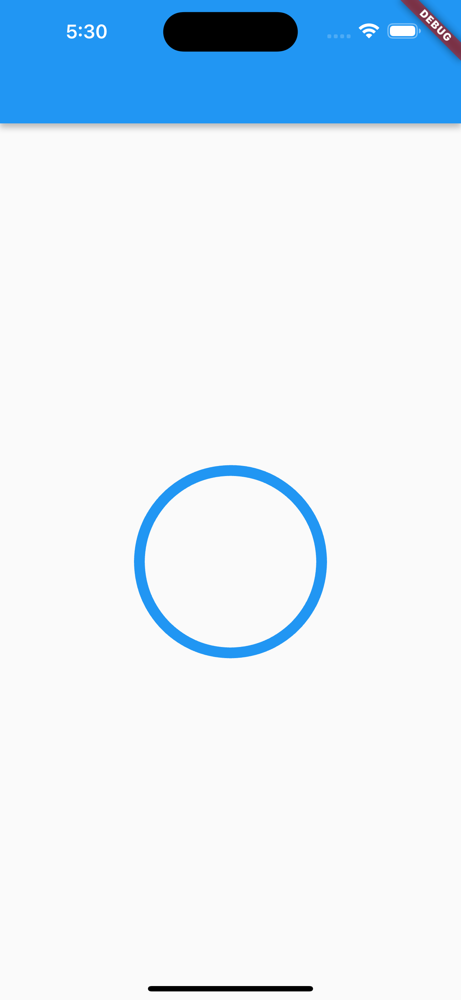
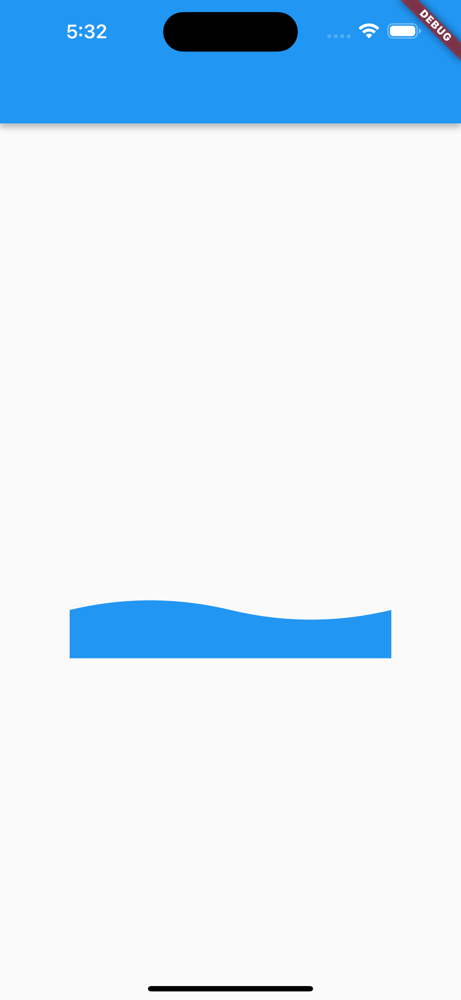
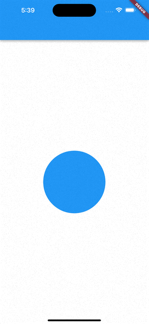

Flutter CustomPaint详解
=======

CustomPaint是Flutter中一个非常强大的绘图组件，它可以让我们自由地绘制各种形状和图案，以满足我们的各种需求。在本文中，我们将详细介绍Flutter CustomPaint的作用、参数、功能和应用场景。

## CustomPaint是什么?

CustomPaint是一个可以自定义绘制的组件。我们可以在它上面绘制各种形状和图案，包括直线、矩形、圆形、曲线等等。它是Flutter中最基础、最灵活的绘图组件之一。

## CustomPaint的作用

CustomPaint的作用非常广泛。我们可以使用它来实现各种各样的绘图需求，比如：

- 绘制自定义图标
- 绘制自定义背景
- 绘制自定义进度条
- 绘制自定义曲线
- 绘制自定义动画

## CustomPaint有哪些参数

CustomPaint有很多参数，下面是一些比较常用的参数：

- size：CustomPaint的大小。
- painter：CustomPainter对象，用于绘制CustomPaint的内容。
- foregroundPainter：CustomPainter对象，用于在CustomPaint内容之上绘制内容。
- child：CustomPaint子节点。
- isComplex：是否复杂。
- willChange：是否会发生变化。

其中，最重要的参数是painter。我们需要通过继承CustomPainter类来实现我们自己的绘制逻辑。在CustomPainter中，我们需要实现两个方法：paint和shouldRepaint。paint方法用于实现具体的绘制逻辑，而shouldRepaint方法用于判断是否需要重新绘制。

## 按照应用场景举例说明如何使用它

下面我们来看一些具体的应用场景，以及如何使用CustomPaint来实现它们。

### 绘制自定义图标

如果我们需要一个自定义的图标，可以使用CustomPaint来实现它。首先，我们需要继承CustomPainter类，并在paint方法中实现具体的绘制逻辑。比如，下面是一个绘制心形图标的例子：

```dart
class HeartIconPainter extends CustomPainter {
  @override
  void paint(Canvas canvas, Size size) {
    final paint = Paint()
      ..color = Colors.red
      ..style = PaintingStyle.fill;

    final path = Path()
      ..moveTo(size.width / 2, size.height / 5)
      ..cubicTo(size.width / 3, 0, 0, size.height / 3.5, size.width / 2, size.height)
      ..cubicTo(size.width, size.height / 3.5, size.width * 2 / 3, 0, size.width / 2, size.height / 5);

    canvas.drawPath(path, paint);
  }

  @override
  bool shouldRepaint(CustomPainter oldDelegate) => false;
}
```

然后，我们可以将HeartIconPainter对象传递给CustomPaint组件，来显示我们自定义的图标：

```
CustomPaint(
  painter: HeartIconPainter(),
),
```

显示的效果应该是这样的



### 绘制自定义背景

如果我们需要一个自定义的背景，可以使用CustomPaint来实现它。首先，我们需要继承CustomPainter类，并在paint方法中实现具体的绘制逻辑。比如，下面是一个绘制渐变背景的例子：

```dart
class GradientBackgroundPainter extends CustomPainter {
  @override
  void paint(Canvas canvas, Size size) {
    final rect = Rect.fromLTWH(0.0, 0.0, size.width, size.height);
    final gradient = LinearGradient(
      begin: Alignment.topCenter,
      end: Alignment.bottomCenter,
      colors: [
        Colors.blue.shade800,
        Colors.blue.shade200,
      ],
    );
    final paint = Paint()..shader = gradient.createShader(rect);
    canvas.drawRect(rect, paint);
  }

  @override
  bool shouldRepaint(CustomPainter oldDelegate) => false;
}
```

然后，我们可以将GradientBackgroundPainter对象传递给CustomPaint组件的foregroundPainter参数，来显示我们自定义的背景：

```dart
CustomPaint(
  foregroundPainter: GradientBackgroundPainter(),
),
```

显示的效果应该是这样的



4.3 绘制自定义进度条

如果我们需要一个自定义的进度条，可以使用CustomPaint来实现它。首先，我们需要继承CustomPainter类，并在paint方法中实现具体的绘制逻辑。比如，下面是一个绘制圆形进度条的例子：

```dart
class CircleProgressBarPainter extends CustomPainter {
  final double progress;

  CircleProgressBarPainter(this.progress);

  @override
  void paint(Canvas canvas, Size size) {
    final paint = Paint()
      ..color = Colors.blue
      ..style = PaintingStyle.stroke
      ..strokeWidth = 10;

    final center = Offset(size.width / 2, size.height / 2);
    final radius = min(size.width / 2, size.height / 2) - paint.strokeWidth / 2;
    canvas.drawCircle(center, radius, paint);

    final progressPaint = Paint()
      ..color = Colors.blue
      ..style = PaintingStyle.stroke
      ..strokeWidth = 10;

    final progressAngle = 2 * pi * progress;
    canvas.drawArc(Rect.fromCircle(center: center, radius: radius), -pi / 2,
        progressAngle, false, progressPaint);
  }

  @override
  bool shouldRepaint(CustomPainter oldDelegate) => false;
}
```

然后，我们可以将CircleProgressBarPainter对象传递给CustomPaint组件，并通过progress参数来控制进度：

```dart
CustomPaint(
  painter: CircleProgressBarPainter(0.6),
),
```

显示的效果应该是这样的



4.4 绘制自定义曲线

如果我们需要一个自定义的曲线，可以使用CustomPaint来实现它。首先，我们需要继承CustomPainter类，并在paint方法中实现具体的绘制逻辑。比如，下面是一个绘制波浪曲线的例子：

```dart
class WaveCurvePainter extends CustomPainter {
  @override
  void paint(Canvas canvas, Size size) {
    final paint = Paint()
      ..color = Colors.blue
      ..style = PaintingStyle.fill;

    final path = Path()
      ..moveTo(0, size.height * 0.75)
      ..quadraticBezierTo(
          size.width * 0.25, size.height * 0.65, size.width * 0.5, size.height * 0.75)
      ..quadraticBezierTo(
          size.width * 0.75, size.height * 0.85, size.width, size.height * 0.75)
      ..lineTo(size.width, size.height)
      ..lineTo(0, size.height)
      ..close();

    canvas.drawPath(path, paint);
  }

  @override
  bool shouldRepaint(CustomPainter oldDelegate) => false;
}
```

然后，我们可以将WaveCurvePainter对象传递给CustomPaint组件，来显示我们自定义的曲线：

```dart
CustomPaint(
  painter: WaveCurvePainter(),
),
```

4.5 绘制自定义动画

显示的效果应该是这样的




如果我们需要一个自定义的动画效果，可以使用CustomPaint来实现它。首先，我们需要继承CustomPainter类，并在paint方法中实现具体的绘制逻辑。比如，下面是一个绘制跳动动画的例子：

```dart
class JumpingBallPainter extends CustomPainter with ChangeNotifier {
  double _value = -1.0;

  void jump() {
    _value = -1.0;
    notifyListeners();
    Future.delayed(Duration(milliseconds: 100), () {
      _value = 1.0;
      notifyListeners();
    });
    Future.delayed(Duration(milliseconds: 200), () {
      _value = -1.0;
      notifyListeners();
    });
    Future.delayed(Duration(milliseconds: 300), () {
      _value = 0.0;
      notifyListeners();
    });
  }

  @override
  void paint(Canvas canvas, Size size) {
    final paint = Paint()..color = Colors.blue;

    final ballSize = min(size.width, size.height) / 2;
    final ballCenter =
        Offset(size.width / 2, size.height / 2 + ballSize * _value);
    canvas.drawCircle(ballCenter, ballSize, paint);
  }

  @override
  bool shouldRepaint(CustomPainter oldDelegate) => true;
}
```

然后，我们可以将JumpingBallPainter对象传递给CustomPaint组件，并通过调用jump方法来触发动画效果：

```dart
final jumpingBallPainter = JumpingBallPainter();
CustomPaint(
  painter: jumpingBallPainter,
),
GestureDetector(
  onTap: () {
    jumpingBallPainter.jump();
  },
),
```
显示的效果应该是这样的




以上就是Flutter CustomPaint的详细介绍。希望通过本文的介绍，大家可以更好地理解Flutter CustomPaint的作用、参数、功能和应用场景，并能够灵活地运用它来满足各种需求。