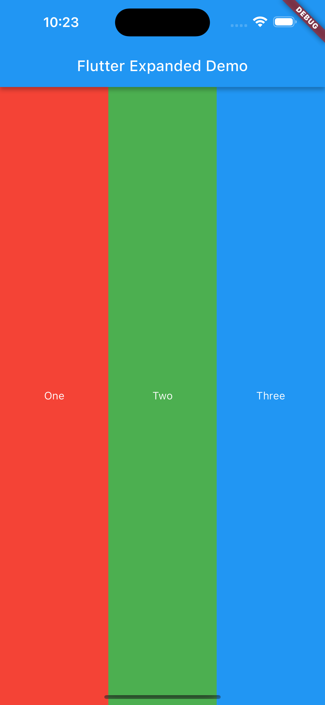
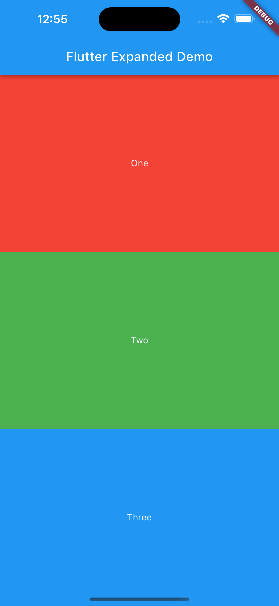
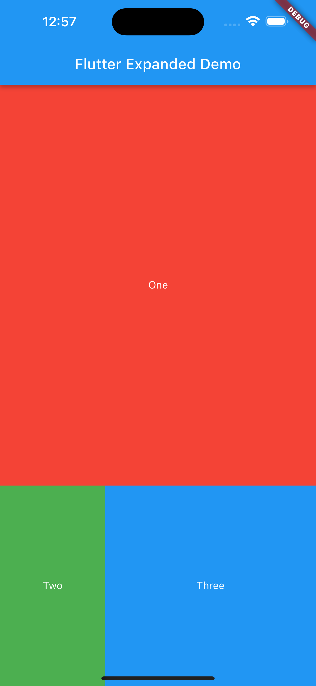

# Flutter Expanded：如何在Row和Column中灵活地分配空间

在Flutter中，有很多小部件可以帮助我们实现各种各样的布局，其中一个非常常用的小部件就是Expanded。Expanded可以让我们在Row和Column中灵活地分配空间，从而实现自适应的布局。本文将介绍Expanded的基本概念、参数、作用以及使用示例。

## 什么是Expanded

Expanded是一个继承自Flexible的小部件，它的作用是让子组件填充Row或Column中的剩余空间。Expanded小部件会根据flex参数来决定子组件占用的空间比例，如果有多个子组件都使用了Expanded，那么它们会根据各自的flex值来分配空间。Expanded小部件只能在Row或Column中使用，否则会抛出异常。

## Expanded有哪些参数

Expanded小部件有两个参数，分别是flex和child。

- flex：这个参数是可选的，它表示子组件占用的空间比例，取值范围是大于0的整数。如果传入一个负数或者0，会抛出异常。如果传入一个null值，会被默认为1。如果有多个子组件都使用了Expanded，那么它们会根据各自的flex值来分配空间，例如，如果一个子组件的flex为2，另一个子组件的flex为1，那么前者会占用2/3的空间，后者会占用1/3的空间。
- child：这个参数是必须的，它表示子组件，可以是任何一个小部件。

## 如何使用Expanded

Expanded小部件的使用非常简单，只需要将它包裹在想要填充空间的子组件外面，然后传入一个flex值即可。下面是一些常见的使用场景和示例代码：

### 在Row中使用Expanded

如果想要让Row中的子组件按照一定的比例占用水平方向的空间，可以使用Expanded小部件来实现。例如，下面的代码展示了如何使用Expanded小部件来实现一个水平方向的三等分布局：

```dart
import 'package:flutter/material.dart';

void main() {
  runApp(MyApp());
}

class MyApp extends StatelessWidget {
  @override
  Widget build(BuildContext context) {
    return MaterialApp(
      home: Scaffold(
        appBar: AppBar(
          title: Text('Flutter Expanded Demo'),
        ),
        body: Center(
          child: Row( // 使用Row小部件来创建一个水平方向的布局
            children: [
              Expanded( // 使用Expanded小部件来包裹第一个子组件
                flex: 1, // 设置flex为1
                child: Container( // 使用容器作为子组件
                  color: Colors.red, // 设置容器的颜色为红色
                  child: Center( // 在容器中居中显示一个文字
                    child: Text(
                      'One',
                      style: TextStyle(color: Colors.white),
                    ),
                  ),
                ),
              ),
              Expanded( // 使用Expanded小部件来包裹第二个子组件
                flex: 1, // 设置flex为1
                child: Container( // 使用容器作为子组件
                  color: Colors.green, // 设置容器的颜色为绿色
                  child: Center( // 在容器中居中显示一个文字
                    child: Text(
                      'Two',
                      style: TextStyle(color: Colors.white),
                    ),
                  ),
                ),
              ),
              Expanded( // 使用Expanded小部件来包裹第三个子组件
                flex: 1, // 设置flex为1
                child: Container( // 使用容器作为子组件
                  color: Colors.blue, // 设置容器的颜色为蓝色
                  child: Center( // 在容器中居中显示一个文字
                    child: Text(
                      'Three',
                      style: TextStyle(color: Colors.white),
                    ),
                  ),
                ),
              ),
            ],
          ),
        ),
      ),
    );
  }
}
```
运行结果如下：



可以看到，Row中的三个子组件都使用了Expanded，并且都设置了相同的flex值，因此它们会平均地占用水平方向的空间，实现了三等分的布局。

### 在Column中使用Expanded

如果想要让Column中的子组件按照一定的比例占用垂直方向的空间，可以使用Expanded小部件来实现。例如，下面的代码展示了如何使用Expanded小部件来实现一个垂直方向的三等分布局：

```dart
import 'package:flutter/material.dart';

void main() {
  runApp(MyApp());
}

class MyApp extends StatelessWidget {
  @override
  Widget build(BuildContext context) {
    return MaterialApp(
      home: Scaffold(
        appBar: AppBar(
          title: Text('Flutter Expanded Demo'),
        ),
        body: Center(
          child: Column( // 使用Column小部件来创建一个垂直方向的布局
            children: [
              Expanded( // 使用Expanded小部件来包裹第一个子组件
                flex: 1, // 设置flex为1
                child: Container( // 使用容器作为子组件
                  color: Colors.red, // 设置容器的颜色为红色
                  child: Center( // 在容器中居中显示一个文字
                    child: Text(
                      'One',
                      style: TextStyle(color: Colors.white),
                    ),
                  ),
                ),
              ),
              Expanded( // 使用Expanded小部件来包裹第二个子组件
                flex: 1, // 设置flex为1
                child: Container( // 使用容器作为子组件
                  color: Colors.green, // 设置容器的颜色为绿色
                  child: Center( // 在容器中居中显示一个文字
                    child: Text(
                      'Two',
                      style: TextStyle(color: Colors.white),
                    ),
                  ),
                ),
              ),
              Expanded( // 使用Expanded小部件来包裹第三个子组件
                flex: 1, // 设置flex为1
                child: Container( // 使用容器作为子组件
                  color: Colors.blue, // 设置容器的颜色为蓝色
                  child: Center( // 在容器中居中显示一个文字
                    child: Text(
                      'Three',
                      style: TextStyle(color: Colors.white),
                    ),
                  ),
                ),
              ),
            ],
          ),
        ),
      ),
    );
  }
}
```
运行结果如下：



可以看到，Column中的三个子组件都使用了Expanded，并且都设置了相同的flex值，因此它们会平均地占用垂直方向的空间，实现了三等分的布局。

### 在Row和Column中混合使用Expanded

如果想要让Row和Column中的子组件按照不同的比例占用空间，可以在Row和Column中混合使用Expanded小部件来实现。例如，下面的代码展示了如何使用Expanded小部件来实现一个复杂的布局：

```dart
import 'package:flutter/material.dart';

void main() {
  runApp(MyApp());
}

class MyApp extends StatelessWidget {
  @override
  Widget build(BuildContext context) {
    return MaterialApp(
      home: Scaffold(
        appBar: AppBar(
          title: Text('Flutter Expanded Demo'),
        ),
        body: Center(
          child: Column( // 使用Column小部件来创建一个垂直方向的布局
            children: [
              Expanded( // 使用Expanded小部件来包裹第一个子组件
                flex: 2, // 设置flex为2
                child: Container( // 使用容器作为子组件
                  color: Colors.red, // 设置容器的颜色为红色
                  child: Center( // 在容器中居中显示一个文字
                    child: Text(
                      'One',
                      style: TextStyle(color: Colors.white),
                    ),
                  ),
                ),
              ),
              Expanded( // 使用Expanded小部件来包裹第二个子组件
                flex: 1, // 设置flex为1
                child: Row( // 使用Row小部件来创建一个水平方向的布局
                  children: [
                    Expanded( // 使用Expanded小部件来包裹第一个子组件
                      flex: 1, // 设置flex为1
                      child: Container( // 使用容器作为子组件
                        color: Colors.green, // 设置容器的颜色为绿色
                        child: Center( // 在容器中居中显示一个文字
                          child: Text(
                            'Two',
                            style: TextStyle(color: Colors.white),
                          ),
                        ),
                      ),
                    ),
                    Expanded( // 使用Expanded小部件来包裹第二个子组件
                      flex: 2, // 设置flex为2
                      child: Container( // 使用容器作为子组件
                        color: Colors.blue, // 设置容器的颜色为蓝色
                        child: Center( // 在容器中居中显示一个文字
                          child: Text(
                            'Three',
                            style: TextStyle(color: Colors.white),
                          ),
                        ),
                      ),
                    ),
                  ],
                ),
              ),
            ],
          ),
        ),
      ),
    );
  }
}
```
运行结果如下：



可以看到，Column中的第一个子组件占用了2/3的垂直方向的空间，第二个子组件占用了1/3的垂直方向的空间。第二个子组件又是一个Row，它的第一个子组件占用了1/3的水平方向的空间，第二个子组件占用了2/3的水平方向的空间，实现了一个复杂的布局。

## 总结

Expanded是一个非常常用的小部件，可以让我们在Row和Column中灵活地分配空间，从而实现自适应的布局。它有两个参数，分别是flex和child，分别用于控制子组件的空间比例和内容。Expanded小部件只能在Row或Column中使用，否则会抛出异常。Expanded小部件可以用于实现三等分、四等分、复杂等分等各种布局，只需要将它包裹在想要填充空间的子组件外面，然后传入一个flex值即可。希望这篇文章对你有所帮助。

更多可以在我的Challenge中找到相关[例子(f_001_widgets_expanded)](https://github.com/davidzou/flutter_challenge/tree/master/f_001_widgets_expanded)