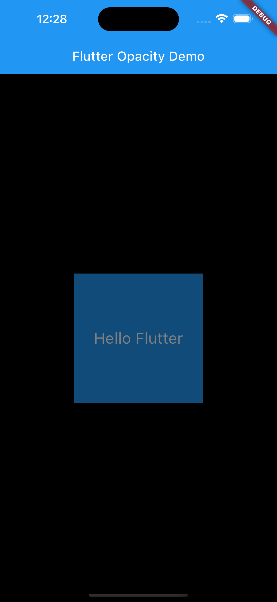
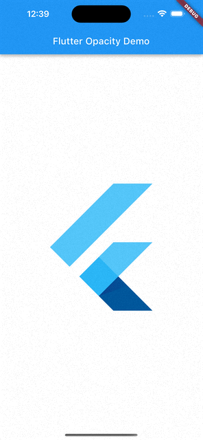
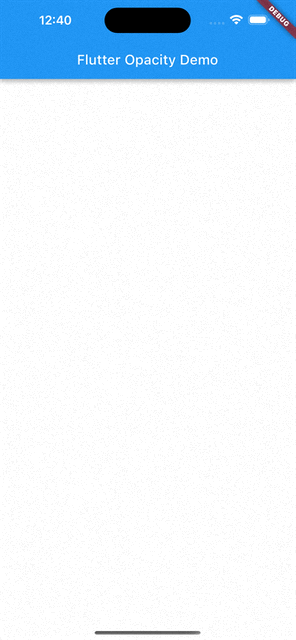
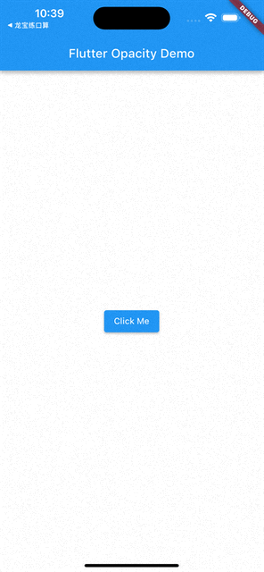

Flutter Opacity：如何控制子组件的透明度
=========

在Flutter中，有很多小部件可以帮助我们实现各种各样的效果，其中一个非常实用的小部件就是Opacity。Opacity可以让我们轻松地控制子组件的透明度，从而实现淡入淡出、渐变、遮罩等效果。本文将介绍Opacity的基本概念、参数、作用以及使用示例。

## 什么是Opacity

Opacity是一个继承自SingleChildRenderObjectWidget的小部件，它的作用是给子组件添加一个透明度的属性。透明度的值是一个0到1之间的浮点数，0表示完全不可见，1表示完全可见，中间的值表示不同程度的透明。Opacity小部件会根据透明度的值来调整子组件的alpha通道，从而实现透明效果。

## Opacity有哪些参数

Opacity小部件有两个参数，分别是opacity和alwaysIncludeSemantics。

- opacity：这个参数是必须的，它表示子组件的透明度，取值范围是0到1之间。如果传入一个负数或者大于1的数，会抛出异常。如果传入一个null值，会被默认为0。
- alwaysIncludeSemantics：这个参数是可选的，它是一个布尔值，用于控制是否在透明度为0的时候仍然保留子组件的语义信息。默认情况下，这个参数为false，也就是说当透明度为0的时候，子组件会被完全忽略，不会响应任何事件或者辅助功能。如果设置为true，那么即使透明度为0，子组件仍然会保留其语义信息，可以被点击或者读取。这个参数的作用主要是为了提高无障碍访问的体验。

## 如何使用Opacity

Opacity小部件的使用非常简单，只需要将它包裹在想要控制透明度的子组件外面，然后传入一个透明度的值即可。下面是一个简单的示例：

```dart
import 'package:flutter/material.dart';

void main() {
  runApp(MyApp());
}

class MyApp extends StatelessWidget {
  @override
  Widget build(BuildContext context) {
    return MaterialApp(
      home: Scaffold(
        appBar: AppBar(
          title: Text('Flutter Opacity Demo'),
        ),
        body: Center(
          child: Opacity(
            opacity: 0.5, // 设置透明度为0.5
            child: Container(
              width: 200,
              height: 200,
              color: Colors.blue,
              child: Center(
                child: Text(
                  'Hello Flutter',
                  style: TextStyle(color: Colors.white, fontSize: 24),
                ),
              ),
            ),
          ),
        ),
      ),
    );
  }
}
```
运行结果如下：



可以看到，蓝色的容器和白色的文字都变得半透明了。如果想要让文字不受透明度的影响，可以把Opacity小部件放在文字的外面，而不是容器的外面，如下：

```dart
import 'package:flutter/material.dart';

void main() {
  runApp(MyApp());
}

class MyApp extends StatelessWidget {
  @override
  Widget build(BuildContext context) {
    return MaterialApp(
      home: Scaffold(
        appBar: AppBar(
          title: Text('Flutter Opacity Demo'),
        ),
        body: Center(
          child: Container(
            width: 200,
            height: 200,
            color: Colors.blue.withOpacity(0.5), // 设置容器颜色的透明度为0.5
            child: Center(
              child: Opacity(
                opacity: 1.0, // 设置文字的透明度为1.0，即不透明
                child: Text(
                  'Hello Flutter',
                  style: TextStyle(color: Colors.white, fontSize: 24),
                ),
              ),
            ),
          ),
        ),
      ),
    );
  }
}
```
运行结果如下：


### 实现淡入淡出效果

如果想要让子组件在可见和不可见之间切换，可以使用Opacity小部件来实现淡入淡出的效果。例如，下面的代码展示了如何使用Opacity小部件来实现一个图片的淡入淡出效果：

```dart
import 'package:flutter/material.dart';

void main() {
  runApp(MyApp());
}

class MyApp extends StatelessWidget {
  @override
  Widget build(BuildContext context) {
    return MaterialApp(
      home: Scaffold(
        appBar: AppBar(
          title: Text('Flutter Opacity Demo'),
        ),
        body: Center(
          child: FadeInOutImage(),
        ),
      ),
    );
  }
}

class FadeInOutImage extends StatefulWidget {
  @override
  _FadeInOutImageState createState() => _FadeInOutImageState();
}

class _FadeInOutImageState extends State<FadeInOutImage> {
  double _opacity = 1.0; // 定义一个透明度的变量

  @override
  Widget build(BuildContext context) {
    return GestureDetector( // 使用手势检测器来监听点击事件
      onTap: () {
        setState(() { // 点击时改变透明度的值
          _opacity = _opacity == 1.0 ? 0.0 : 1.0;
        });
      },
      child: Opacity( // 使用Opacity小部件来控制图片的透明度
        opacity: _opacity,
        child: FlutterLogo(
          size: 300,
        ),
      ),
    );
  }
}
```
运行结果如下：



可以看到，每次点击图片，它就会在完全可见和完全不可见之间切换，实现了淡入淡出的效果。

### 实现渐变效果

如果想要让子组件在不同的透明度之间变化，可以使用Opacity小部件来实现渐变的效果。例如，下面的代码展示了如何使用Opacity小部件来实现一个文字的渐变效果：

```dart
import 'package:flutter/material.dart';

void main() {
  runApp(MyApp());
}

class MyApp extends StatelessWidget {
  @override
  Widget build(BuildContext context) {
    return MaterialApp(
      home: Scaffold(
        appBar: AppBar(
          title: Text('Flutter Opacity Demo'),
        ),
        body: Center(
          child: GradientText(),
        ),
      ),
    );
  }
}

class GradientText extends StatefulWidget {
  @override
  _GradientTextState createState() => _GradientTextState();
}

class _GradientTextState extends State<GradientText> {
  double _opacity = 0.0; // 定义一个透明度的变量

  @override
  void initState() {
    super.initState();
    _changeOpacity(); // 在初始化时调用改变透明度的方法
  }

  void _changeOpacity() async { // 定义一个异步的方法来改变透明度的值
    while (true) { // 使用一个无限循环来不断地改变透明度的值
      await Future.delayed(Duration(seconds: 1)); // 每隔一秒执行一次
      setState(() { // 改变状态
        _opacity = _opacity == 0.0 ? 1.0 : 0.0; // 如果透明度为0，就改为1，反之亦然
      });
    }
  }

  @override
  Widget build(BuildContext context) {
    return Opacity( // 使用Opacity小部件来控制文字的透明度
      opacity: _opacity,
      child: Text( // 使用文字作为子组件
        'Hello Flutter',
        style: TextStyle(color: Colors.blue, fontSize: 24),
      ),
    );
  }
}
```
运行结果如下：



可以看到，文字会在不透明和透明之间不断地变化，实现了渐变的效果。

### 实现遮罩效果

如果想要让子组件在某些情况下被遮挡，可以使用Opacity小部件来实现遮罩的效果。例如，下面的代码展示了如何使用Opacity小部件来实现一个按钮的遮罩效果：

```dart
import 'package:flutter/material.dart';

void main() {
  runApp(MyApp());
}

class MyApp extends StatelessWidget {
  @override
  Widget build(BuildContext context) {
    return MaterialApp(
      home: Scaffold(
        appBar: AppBar(
          title: Text('Flutter Opacity Demo'),
        ),
        body: Center(
          child: MaskedButton(),
        ),
      ),
    );
  }
}

class MaskedButton extends StatefulWidget {
  @override
  _MaskedButtonState createState() => _MaskedButtonState();
}

class _MaskedButtonState extends State<MaskedButton> {
  bool _isDisabled = false; // 定义一个布尔值来表示按钮是否被禁用

  @override
  Widget build(BuildContext context) {
    return Stack( // 使用Stack小部件来叠加两个子组件
      alignment: Alignment.center, // 设置对齐方式为居中
      children: [
        ElevatedButton( // 使用ElevatedButton作为底层的子组件
          onPressed: _isDisabled ? null : () { // 根据_isDisabled的值来决定是否响应点击事件
            setState(() { // 改变状态
              _isDisabled = !_isDisabled; // 反转_isDisabled的值
            });
          },
          child: Text('Click Me'), // 设置按钮的文字
        ),
        IgnorePointer(
          child: Opacity( // 使用Opacity作为顶层的子组件
            opacity: _isDisabled ? 0.9 : 0.0, // 根据_isDisabled的值来设置透明度，如果为true，就设置为0.9，否则设置为0
            // alwaysIncludeSemantics: true,
            child: Container( // 使用容器作为子组件
              width: 100,
              height: 50,
              color: Colors.grey, // 设置容器的颜色为灰色
              child: Center( // 在容器中居中显示一个文字
                child: Text(
                  'Disabled',
                  style: TextStyle(color: Colors.white),
                ),
              ),
            ),
          ),
        ),
      ],
    );
  }
}
```
运行结果如下：



可以看到，当按钮被点击时，它会被一个半透明的灰色容器遮挡，并显示“Disabled”的文字，实现了遮罩的效果。

## 总结

Opacity是一个非常实用的小部件，可以让我们轻松地实现子组件的透明度变化。它有两个参数，分别是opacity和alwaysIncludeSemantics，分别用于控制子组件的透明度和语义信息。
Opacity小部件可以用于实现淡入淡出、渐变、遮罩等效果，只需要将它包裹在想要控制透明度的子组件外面，然后传入一个透明度的值即可。希望这篇文章对你有所帮助。