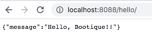

Bootique初探
====

***

### 介绍

Bootque改进了无容器应用启动的现有技术。它使你可以编写看起来像命令一样并由模块组成的Java应用。号称要比SpringBoot快10倍以上。今天我就来试一试它。[Bootique.io](https://bootique.io/)是项目的官方站点。

### HelloWorld [^getting_start]

* 创建项目

    ```
    zzw:challenge zzw$mkdir boonique_fist_attempt
    zzw:challenge zzw$cd boonique_first_attempt
    zzw:boonique_fist_attempt zzw$mkdir -p src/main/java/com/wonderingwall/
    ```

* 创建pom.xml

    ```
    zzw:boonique_fist_attempt zzw$ vi pom.xml
    <project xmlns="http://maven.apache.org/POM/4.0.0" xmlns:xsi="http://www.w3.org/2001/XMLSchema-instance"
             xsi:schemaLocation="http://maven.apache.org/POM/4.0.0 http://maven.apache.org/xsd/maven-4.0.0.xsd">
        <modelVersion>4.0.0</modelVersion>

        <parent>
            <groupId>io.bootique.parent</groupId>
            <artifactId>bootique-parent</artifactId>
            <version>0.13</version>
        </parent>

        <groupId>com.wonderingwall</groupId>
        <artifactId>first-attempt</artifactId>
        <version>0.0.1-SNAPSHOT</version>
        <packaging>jar</packaging>

        <name>bootique-first-attempt</name>

        <properties>
            <main.class>com.wonderingwall.App</main.class>
        </properties>

        <dependencyManagement>
            <dependencies>
                <dependency>
                    <groupId>io.bootique.bom</groupId>
                    <artifactId>bootique-bom</artifactId>
                    <version>1.0.RC1</version>
                    <scope>import</scope>
                    <type>pom</type>
                </dependency>
            </dependencies>
        </dependencyManagement>

        <dependencies>
            <dependency>
                <groupId>io.bootique</groupId>
                <artifactId>bootique</artifactId>
            </dependency>
            <dependency>
                <groupId>io.bootique.jersey</groupId>
                <artifactId>bootique-jersey</artifactId>
            </dependency>
            <dependency>
                <groupId>io.bootique.logback</groupId>
                <artifactId>bootique-logback</artifactId>
            </dependency>
        </dependencies>

        <build>
            <plugins>
                <plugin>
                    <artifactId>maven-shade-plugin</artifactId>
                </plugin>
            </plugins>
        </build>
    </project>
    ```

* 创建`App.Java`

    ```
    zzw:boonique_fist_attempt zzw$ vi src/main/java/com/wonderingwall/App.java
    package com.wonderingwall;

    import com.google.inject.Binder;
    import com.google.inject.Module;
    import io.bootique.Bootique;
    import io.bootique.jersey.JerseyModule;

    /**
     * Hello world!
     */
    public class App implements Module {

        public static void main(String[] args) {
            Bootique.app(args)
                    .autoLoadModules()
                    .module(App.class)
                    .exec()
                    .exit();
        }

        @Override
        public void configure(Binder binder) {
            JerseyModule.extend(binder).addResource(HelloApi.class);
        }
    }

    ```

* 创建RestApi接口类`HelloApi.java` 。这里符合[Java JAX-RS API标准](https://en.wikipedia.org/wiki/Java_API_for_RESTful_Web_Services)

    ```
    zzw:boonique_fist_attempt zzw$ vi src/main/java/com/wonderingwall/HelloApi.java
    package com.wonderingwall;

    import javax.ws.rs.GET;
    import javax.ws.rs.Path;
    import javax.ws.rs.Produces;
    import javax.ws.rs.core.MediaType;

    @Path("/")
    public class HelloApi {

        @GET
        @Produces(MediaType.APPLICATION_JSON)
        public String get() {
            return "{\"message\":\"Hello, Bootique!!\"}";
        }

    }
    ```

* 看下未编译前的目录结构

    ```
    zzw:boonique_fist_attempt zzw$ tree .
    .
    ├── pom.xml
    └── src
        └── main
            └── java
                └── com
                    └── wonderingwall
                        ├── App.java
                        └── HelloApi.java

    5 directories, 4 files
    ```

* 编译项目

    ```
    zzw:boonique_fist_attempt zzw$ mvn clean package
    [INFO] Scanning for projects...
    [INFO]
    [INFO] ------------------------------------------------------------------------
    [INFO] Building bootique-first-attempt 0.0.1-SNAPSHOT
    [INFO] ------------------------------------------------------------------------
    [INFO]
    [INFO] --- maven-clean-plugin:2.5:clean (default-clean) @ first-attempt ---
    [INFO]
    [INFO] --- maven-resources-plugin:2.6:resources (default-resources) @ first-attempt ---
    [INFO] Using 'UTF-8' encoding to copy filtered resources.
    [INFO] skip non existing resourceDirectory /Users/zzw/Develop/workspace/github/WonderingWall/challenge/boonique_fist_attempt/src/main/resources
    [INFO]
    [INFO] --- maven-compiler-plugin:3.1:compile (default-compile) @ first-attempt ---
    [INFO] Changes detected - recompiling the module!
    [INFO] Compiling 2 source files to /Users/zzw/Develop/workspace/github/WonderingWall/challenge/boonique_fist_attempt/target/classes
    [INFO]
    [INFO] --- maven-resources-plugin:2.6:testResources (default-testResources) @ first-attempt ---
    [INFO] Using 'UTF-8' encoding to copy filtered resources.
    [INFO] skip non existing resourceDirectory /Users/zzw/Develop/workspace/github/WonderingWall/challenge/boonique_fist_attempt/src/test/resources
    [INFO]
    [INFO] --- maven-compiler-plugin:3.1:testCompile (default-testCompile) @ first-attempt ---
    [INFO] No sources to compile
    [INFO]
    [INFO] --- maven-surefire-plugin:2.22.1:test (default-test) @ first-attempt ---
    [INFO] No tests to run.
    [INFO]
    [INFO] --- maven-jar-plugin:3.1.0:jar (default-jar) @ first-attempt ---
    [INFO] Building jar: /Users/zzw/Develop/workspace/github/WonderingWall/challenge/boonique_fist_attempt/target/first-attempt-0.0.1-SNAPSHOT.jar
    [INFO]
    [INFO] --- maven-shade-plugin:3.2.1:shade (default) @ first-attempt ---
    [INFO] Including io.bootique:bootique:jar:1.0.RC1 in the shaded jar.
    [INFO] Including com.google.inject:guice:jar:4.2.0 in the shaded jar.
    [INFO] Including javax.inject:javax.inject:jar:1 in the shaded jar.
    [INFO] Including aopalliance:aopalliance:jar:1.0 in the shaded jar.
    [INFO] Including com.google.guava:guava:jar:23.6-android in the shaded jar.
    [INFO] Including org.checkerframework:checker-compat-qual:jar:2.0.0 in the shaded jar.
    [INFO] Including com.fasterxml.jackson.core:jackson-databind:jar:2.9.5 in the shaded jar.
    [INFO] Including com.fasterxml.jackson.core:jackson-annotations:jar:2.9.5 in the shaded jar.
    [INFO] Including com.fasterxml.jackson.core:jackson-core:jar:2.9.5 in the shaded jar.
    [INFO] Including com.fasterxml.jackson.dataformat:jackson-dataformat-yaml:jar:2.9.5 in the shaded jar.
    [INFO] Including org.yaml:snakeyaml:jar:1.18 in the shaded jar.
    [INFO] Including net.sf.jopt-simple:jopt-simple:jar:5.0.3 in the shaded jar.
    [INFO] Including io.bootique.jersey:bootique-jersey:jar:1.0.RC1 in the shaded jar.
    [INFO] Including io.bootique.jetty:bootique-jetty:jar:1.0.RC1 in the shaded jar.
    [INFO] Including org.eclipse.jetty:jetty-server:jar:9.4.12.v20180830 in the shaded jar.
    [INFO] Including javax.servlet:javax.servlet-api:jar:3.1.0 in the shaded jar.
    [INFO] Including org.eclipse.jetty:jetty-http:jar:9.4.12.v20180830 in the shaded jar.
    [INFO] Including org.eclipse.jetty:jetty-util:jar:9.4.12.v20180830 in the shaded jar.
    [INFO] Including org.eclipse.jetty:jetty-io:jar:9.4.12.v20180830 in the shaded jar.
    [INFO] Including org.eclipse.jetty:jetty-servlet:jar:9.4.12.v20180830 in the shaded jar.
    [INFO] Including org.eclipse.jetty:jetty-security:jar:9.4.12.v20180830 in the shaded jar.
    [INFO] Including org.slf4j:slf4j-api:jar:1.7.25 in the shaded jar.
    [INFO] Including javax.xml.bind:jaxb-api:jar:2.3.0 in the shaded jar.
    [INFO] Including javax.activation:activation:jar:1.1.1 in the shaded jar.
    [INFO] Including org.glassfish.jersey.containers:jersey-container-servlet:jar:2.27 in the shaded jar.
    [INFO] Including org.glassfish.jersey.containers:jersey-container-servlet-core:jar:2.27 in the shaded jar.
    [INFO] Including org.glassfish.jersey.core:jersey-server:jar:2.27 in the shaded jar.
    [INFO] Including org.glassfish.jersey.core:jersey-client:jar:2.27 in the shaded jar.
    [INFO] Including org.glassfish.jersey.media:jersey-media-jaxb:jar:2.27 in the shaded jar.
    [INFO] Including javax.validation:validation-api:jar:1.1.0.Final in the shaded jar.
    [INFO] Including javax.ws.rs:javax.ws.rs-api:jar:2.1 in the shaded jar.
    [INFO] Including org.glassfish.jersey.core:jersey-common:jar:2.27 in the shaded jar.
    [INFO] Including javax.annotation:javax.annotation-api:jar:1.2 in the shaded jar.
    [INFO] Including org.glassfish.hk2:osgi-resource-locator:jar:1.0.1 in the shaded jar.
    [INFO] Including org.glassfish.jersey.inject:jersey-hk2:jar:2.27 in the shaded jar.
    [INFO] Including org.glassfish.hk2:hk2-locator:jar:2.5.0-b42 in the shaded jar.
    [INFO] Including org.glassfish.hk2:hk2-api:jar:2.5.0-b42 in the shaded jar.
    [INFO] Including org.glassfish.hk2:hk2-utils:jar:2.5.0-b42 in the shaded jar.
    [INFO] Including org.javassist:javassist:jar:3.22.0-CR2 in the shaded jar.
    [INFO] Including io.bootique.logback:bootique-logback:jar:1.0.RC1 in the shaded jar.
    [INFO] Including ch.qos.logback:logback-classic:jar:1.1.9 in the shaded jar.
    [INFO] Including ch.qos.logback:logback-core:jar:1.1.9 in the shaded jar.
    [INFO] Including org.slf4j:jul-to-slf4j:jar:1.7.25 in the shaded jar.
    [WARNING] Discovered module-info.class. Shading will break its strong encapsulation.
    [INFO] Replacing original artifact with shaded artifact.
    [INFO] Replacing /Users/zzw/Develop/workspace/github/WonderingWall/challenge/boonique_fist_attempt/target/first-attempt-0.0.1-SNAPSHOT.jar with /Users/zzw/Develop/workspace/github/WonderingWall/challenge/boonique_fist_attempt/target/first-attempt-0.0.1-SNAPSHOT-shaded.jar
    [INFO] Dependency-reduced POM written at: /Users/zzw/Develop/workspace/github/WonderingWall/challenge/boonique_fist_attempt/dependency-reduced-pom.xml
    [INFO] ------------------------------------------------------------------------
    [INFO] BUILD SUCCESS
    [INFO] ------------------------------------------------------------------------
    [INFO] Total time: 7.637 s
    [INFO] Finished at: 2020-03-28T21:43:04+08:00
    [INFO] Final Memory: 39M/292M
    [INFO] ------------------------------------------------------------------------

    ```

* 编译后目录结构如下

    ```
    zzw:boonique_fist_attempt zzw$ tree .
    .
    ├── dependency-reduced-pom.xml
    ├── pom.xml
    ├── src
    │   └── main
    │       └── java
    │           └── com
    │               └── wonderingwall
    │                   ├── App.java
    │                   └── HelloApi.java
    └── target
        ├── classes
        │   └── com
        │       └── wonderingwall
        │           ├── App.class
        │           └── HelloApi.class
        ├── first-attempt-0.0.1-SNAPSHOT.jar
        ├── generated-sources
        │   └── annotations
        ├── maven-archiver
        │   └── pom.properties
        ├── maven-status
        │   └── maven-compiler-plugin
        │       └── compile
        │           └── default-compile
        │               ├── createdFiles.lst
        │               └── inputFiles.lst
        └── original-first-attempt-0.0.1-SNAPSHOT.jar


    ```

* 直接运行jar可以得到一份类似命令行帮助文档。

    ```
    zzw:boonique_fist_attempt zzw$ java -jar target/first-attempt-0.0.1-SNAPSHOT.jar
    NAME
          first-attempt-0.0.1-SNAPSHOT.jar

    OPTIONS
          -c yaml_location, --config=yaml_location
               Specifies YAML config location, which can be a file path or a URL.

          -h, --help
               Prints this message.

          -H, --help-config
               Prints information about application modules and their configuration options.

          -s, --server
               Starts Jetty server.
    ```

* 上面帮助我们可以看到，我们只要加入`--server`就可以运行我们的程序了。

    ```
    zzw:boonique_fist_attempt zzw$ java -jar target/first-attempt-0.0.1-SNAPSHOT.jar -s
    INFO  [2020-03-28 13:53:25,051] main o.e.jetty.util.log: Logging initialized @1628ms to org.eclipse.jetty.util.log.Slf4jLog
    INFO  [2020-03-28 13:53:25,181] main i.b.j.s.ServerFactory: Adding listener io.bootique.jetty.servlet.DefaultServletEnvironment
    INFO  [2020-03-28 13:53:25,191] main i.b.j.s.ServletFactory: Adding servlet 'jersey' mapped to /*
    INFO  [2020-03-28 13:53:25,249] main i.b.j.s.ServerLifecycleLogger: Starting jetty...
    INFO  [2020-03-28 13:53:25,253] main o.e.j.server.Server: jetty-9.4.z-SNAPSHOT; built: 2018-08-30T13:59:14.071Z; git: 27208684755d94a92186989f695db2d7b21ebc51; jvm 1.8.0_161-b12
    INFO  [2020-03-28 13:53:25,314] main o.e.j.server.session: DefaultSessionIdManager workerName=node0
    INFO  [2020-03-28 13:53:25,314] main o.e.j.server.session: No SessionScavenger set, using defaults
    INFO  [2020-03-28 13:53:25,320] main o.e.j.server.session: node0 Scavenging every 660000ms
    WARN  [2020-03-28 13:53:25,964] main o.g.j.i.i.Providers: A provider com.wonderingwall.HelloApi registered in SERVER runtime does not implement any provider interfaces applicable in the SERVER runtime. Due to constraint configuration problems the provider com.wonderingwall.HelloApi will be ignored.
    INFO  [2020-03-28 13:53:26,177] main o.e.j.s.h.ContextHandler: Started o.e.j.s.ServletContextHandler@704b2127{/,null,AVAILABLE}
    INFO  [2020-03-28 13:53:26,250] main o.e.j.s.AbstractConnector: Started ServerConnector@2f24886a{HTTP/1.1,[http/1.1]}{0.0.0.0:8080}
    INFO  [2020-03-28 13:53:26,251] main o.e.j.server.Server: Started @2834ms
    INFO  [2020-03-28 13:53:26,399] main i.b.j.s.ServerLifecycleLogger: Started Jetty in 1002 ms. Base URL: http://127.0.0.1:8080/
    ```

    浏览器中键入`http://localhost:8080`就可以获得我们所需的结果了。

    

* 路径配置则是通过yaml文件配置。你可以查看帮助文件使用`-H`参数。我这里添加了`config.yml`

    ```
    zzw:boonique_fist_attempt zzw$ cat config.yml
    jetty:
      context: /hello
      connectors:
        - port: 8088
    ```

* 运行结果如下

    ```
        zzw:boonique_fist_attempt zzw$ java -jar target/first-attempt-0.0.1-SNAPSHOT.jar -s --config=config.yml
    INFO  [2020-03-28 13:54:54,640] main o.e.jetty.util.log: Logging initialized @1775ms to org.eclipse.jetty.util.log.Slf4jLog
    INFO  [2020-03-28 13:54:54,725] main i.b.j.s.ServerFactory: Adding listener io.bootique.jetty.servlet.DefaultServletEnvironment
    INFO  [2020-03-28 13:54:54,737] main i.b.j.s.ServletFactory: Adding servlet 'jersey' mapped to /*
    INFO  [2020-03-28 13:54:54,794] main i.b.j.s.ServerLifecycleLogger: Starting jetty...
    INFO  [2020-03-28 13:54:54,798] main o.e.j.server.Server: jetty-9.4.z-SNAPSHOT; built: 2018-08-30T13:59:14.071Z; git: 27208684755d94a92186989f695db2d7b21ebc51; jvm 1.8.0_161-b12
    INFO  [2020-03-28 13:54:54,844] main o.e.j.server.session: DefaultSessionIdManager workerName=node0
    INFO  [2020-03-28 13:54:54,844] main o.e.j.server.session: No SessionScavenger set, using defaults
    INFO  [2020-03-28 13:54:54,848] main o.e.j.server.session: node0 Scavenging every 600000ms
    WARN  [2020-03-28 13:54:55,409] main o.g.j.i.i.Providers: A provider com.wonderingwall.HelloApi registered in SERVER runtime does not implement any provider interfaces applicable in the SERVER runtime. Due to constraint configuration problems the provider com.wonderingwall.HelloApi will be ignored.
    INFO  [2020-03-28 13:54:55,618] main o.e.j.s.h.ContextHandler: Started o.e.j.s.ServletContextHandler@73386d72{/hello,null,AVAILABLE}
    INFO  [2020-03-28 13:54:55,700] main o.e.j.s.AbstractConnector: Started ServerConnector@226f556a{HTTP/1.1,[http/1.1]}{0.0.0.0:8088}
    INFO  [2020-03-28 13:54:55,700] main o.e.j.server.Server: Started @2846ms
    INFO  [2020-03-28 13:54:55,709] main i.b.j.s.ServerLifecycleLogger: Started Jetty in 907 ms. Base URL: http://127.0.0.1:8088/hello

    ```

    浏览器中键入`http://localhost:8088/hello`

    

### 总结

总体的开发流程和SpringBoot差不多，运行的速度的确显而易见，毕竟Guice是Google开源的一个依赖注入类库，相比于Spring IoC来说更小更快。Bootique文档不多，但是入门够用，要一定的开发基础才能深入。关注度也不够高。不过的确很适合现在的微服务架构轻量级的开发，快速而高效。我这里直接Vim编写了，没有用到IDE，稍微有所了解还好，否则没有提示开发难度还是会上升，幸亏只是基于Maven管理。

### 参考

[^getting_start]: [官方HelloWold](https://bootique.io/docs/1.x/getting-started/)
