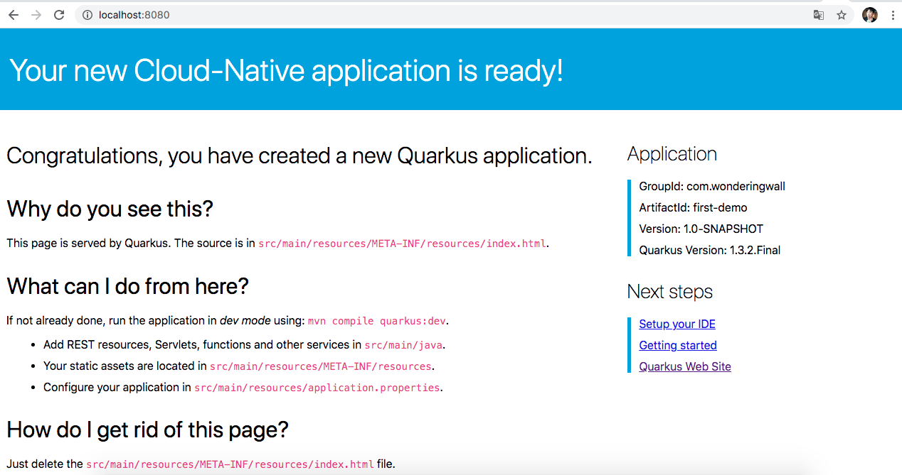

Quarkus初探
====

> 开场白

我们知道StringBoot的在开发商的地位，一直到现在的5.0，很多微服务的搭建还是大量基于它开发的，时代的变迁，也有历史的原因导致了
SpringBoot在启动速度上一直是个问题，尽管有很多优化启动的方案。上次对bootique做了基本的了解，短时间内也不会撼动SpringBoot
的地位。但是不得不提的是近期IBM换帅，5天前Quarkus1.3.2的发布，不得不对这个云世界中占据小片江山的框架做下介绍。

> 准备

- JDK8或者JDK11更高

- Apache Maven 3.6.2以上。（我这里用了brew安装，替换了我之前source安装方式）

``` 
zzw:blog zzw$ mvn --version
Apache Maven 3.6.3 (cecedd343002696d0abb50b32b541b8a6ba2883f)
Maven home: /usr/local/Cellar/maven/3.6.3_1/libexec
Java version: 13.0.2, vendor: N/A, runtime: /usr/local/Cellar/openjdk/13.0.2+8_2/libexec/openjdk.jdk/Contents/Home
Default locale: zh_CN_#Hans, platform encoding: UTF-8
OS name: "mac os x", version: "10.13.6", arch: "x86_64", family: "mac"

zzw:blog zzw$ java -version
java version "1.8.0_161"
Java(TM) SE Runtime Environment (build 1.8.0_161-b12)
```

> 示例

你可以按照[Bootstrapping](https://quarkus.io/guides/getting-started#bootstrapping-the-project)项目j进行操作，然后逐步创建应用。

也可以下载示例项目，示例项目位于`getting-started`

```
git clone https://github.com/quarkusio/quarkus-quickstarts.git
```

> 首次创建项目

忽略下载项，创建一个项目耗时7s，我的MBP是2011年的🤦‍♂️

```
zzw:temp zzw$ time mvn io.quarkus:quarkus-maven-plugin:1.3.2.Final:create -DprojectGroupId=com.wonderingwall -DprojectArtifactId=first-demo -DclassName="com.wonderingwall.quarkus.FirstResource" -Dpath="/hello"
[INFO] Scanning for projects...
[INFO] 
[INFO] ------------------< org.apache.maven:standalone-pom >-------------------
[INFO] Building Maven Stub Project (No POM) 1
[INFO] --------------------------------[ pom ]---------------------------------
[INFO] 
[INFO] --- quarkus-maven-plugin:1.3.2.Final:create (default-cli) @ standalone-pom ---
Creating a new project in /Users/zzw/Develop/workspace/github/temp/first-demo
[INFO] 
[INFO] Maven Wrapper version 0.5.6 has been successfully set up for your project.
[INFO] Using Apache Maven: 3.6.3
[INFO] Repo URL in properties file: https://repo.maven.apache.org/maven2
[INFO] 
[INFO] 
[INFO] ========================================================================================
[INFO] Your new application has been created in /Users/zzw/Develop/workspace/github/temp/first-demo
[INFO] Navigate into this directory and launch your application with mvn quarkus:dev
[INFO] Your application will be accessible on http://localhost:8080
[INFO] ========================================================================================
[INFO] 
[INFO] ------------------------------------------------------------------------
[INFO] BUILD SUCCESS
[INFO] ------------------------------------------------------------------------
[INFO] Total time:  4.578 s
[INFO] Finished at: 2020-04-16T12:18:54+08:00
[INFO] ------------------------------------------------------------------------

real	0m7.519s
user	0m13.601s
sys	0m1.086s
```

**这样就创建了一个getting-started的项目。包含了以下内容：**

- Maven的项目结构。
- 类`com.wonderingwall.quarkus.GreetingResource`指向了路径`/hello`
- 包含了相关的单元测试。
- `http://localhost:8080`是启动应用程序后可访问的登录页面。
- `native`和`jvm`两种模式的`Dockerfile`文件在`src/main/docker`下。
- 应用的配置文件。

包含了最简单的Rest请求接口。

```
zzw:temp zzw$ cat getting-started/src/main/java/com/wonderingwall/quarkus/FirstResource.java 
package com.wonderingwall.quarkus;

import javax.ws.rs.GET;
import javax.ws.rs.Path;
import javax.ws.rs.Produces;
import javax.ws.rs.core.MediaType;

@Path("/hello")
public class FirstResource {

    @GET
    @Produces(MediaType.TEXT_PLAIN)
    public String hello() {
        return "hello";
    }
} 
```

**与vanilla JAX-RS的区别:**

使用Quarkus，不需要创建`Application`类。它支持，但不是必需的。此外，只创建资源的一个实例，而不是每个请求创建一个实例。
您可以使用不同的作用域注释（ApplicationScoped、RequestScoped等）对此进行配置。

> 启动应用

使用命令`mvnw compile quarkus:dev`运行。

```
zzw:first-demo zzw$ mvnw compile quarkus:dev
[INFO] Scanning for projects...
[INFO] 
[INFO] --------------------< com.wonderingwall:first-demo >--------------------
[INFO] Building first-demo 1.0-SNAPSHOT
[INFO] --------------------------------[ jar ]---------------------------------
[INFO] 
[INFO] --- maven-resources-plugin:2.6:resources (default-resources) @ first-demo ---
[INFO] Using 'UTF-8' encoding to copy filtered resources.
[INFO] Copying 2 resources
[INFO] 
[INFO] --- maven-compiler-plugin:3.8.1:compile (default-compile) @ first-demo ---
[INFO] Changes detected - recompiling the module!
[INFO] Compiling 1 source file to /Users/zzw/Develop/workspace/github/temp/first-demo/target/classes
[INFO] ------------------------------------------------------------------------
[INFO] BUILD FAILURE
[INFO] ------------------------------------------------------------------------
[INFO] Total time:  3.870 s
[INFO] Finished at: 2020-04-16T12:19:16+08:00
[INFO] ------------------------------------------------------------------------
[ERROR] Failed to execute goal org.apache.maven.plugins:maven-compiler-plugin:3.8.1:compile (default-compile) on project first-demo: Fatal error compiling: 无效的目标发行版: 11 -> [Help 1]
[ERROR] 
[ERROR] To see the full stack trace of the errors, re-run Maven with the -e switch.
[ERROR] Re-run Maven using the -X switch to enable full debug logging.
[ERROR] 
[ERROR] For more information about the errors and possible solutions, please read the following articles:
[ERROR] [Help 1] http://cwiki.apache.org/confluence/display/MAVEN/MojoExecutionException
```

编译失败，错误的发行版。原因我用的JDK8，没有11。修改pom.xml文件：

``` 
11     <maven.compiler.source>8</maven.compiler.source>
12     <maven.compiler.target>8</maven.compiler.target>
```

继续执行`mvnw compile quarkus:dev`。

```
zzw:first-demo zzw$ mvnw compile quarkus:dev
[INFO] Scanning for projects...
[INFO] 
[INFO] --------------------< com.wonderingwall:first-demo >--------------------
[INFO] Building first-demo 1.0-SNAPSHOT
[INFO] --------------------------------[ jar ]---------------------------------
[INFO] 
[INFO] --- maven-resources-plugin:2.6:resources (default-resources) @ first-demo ---
[INFO] Using 'UTF-8' encoding to copy filtered resources.
[INFO] Copying 2 resources
[INFO] 
[INFO] --- maven-compiler-plugin:3.8.1:compile (default-compile) @ first-demo ---
[INFO] Changes detected - recompiling the module!
[INFO] Compiling 1 source file to /Users/zzw/Develop/workspace/github/temp/first-demo/target/classes
[INFO] 
[INFO] --- quarkus-maven-plugin:1.3.2.Final:dev (default-cli) @ first-demo ---
Listening for transport dt_socket at address: 5005
__  ____  __  _____   ___  __ ____  ______ 
 --/ __ \/ / / / _ | / _ \/ //_/ / / / __/ 
 -/ /_/ / /_/ / __ |/ , _/ ,< / /_/ /\ \   
--\___\_\____/_/ |_/_/|_/_/|_|\____/___/   
2020-04-16 12:23:15,986 INFO  [io.quarkus] (main) first-demo 1.0-SNAPSHOT (powered by Quarkus 1.3.2.Final) started in 5.584s. Listening on: http://0.0.0.0:8080
2020-04-16 12:23:16,002 INFO  [io.quarkus] (main) Profile dev activated. Live Coding activated.
2020-04-16 12:23:16,002 INFO  [io.quarkus] (main) Installed features: [cdi, resteasy]


```

访问`http://localhost:8080`，显示如下：



查看下接口调用情形：

```
zzw:getting-started zzw$ http localhost:8080/hello
HTTP/1.1 200 OK
Content-Length: 5
Content-Type: text/plain;charset=UTF-8

hello
 
```

> 依赖注入

Quarkus中的依赖注入基于ArC，它是为Quarkus架构量身定制的基于CDI的依赖注入解决方案。

添加Bean文件。

```
1 package com.wonderingwall.quarkus;
2 
3 import javax.enterprise.context.ApplicationScoped;
4 
5 @ApplicationScoped
6 public class FirstService {
7 
8     public String getSay(String name) {
9         return "hello " + name;
10     }
11 } 
```

添加访问路径，注入Bean。

```
1 package com.wonderingwall.quarkus;
2 
3 import javax.inject.Inject;
4 import javax.ws.rs.GET;
5 import javax.ws.rs.Path;
6 import javax.ws.rs.Produces;
7 import javax.ws.rs.core.MediaType;
8 
9 import org.jboss.resteasy.annotations.jaxrs.PathParam;
10 
11 @Path("/hello")
12 public class FirstResource {
13 
14     @Inject
15     FirstService service;
16 
17     @GET
18     @Produces(MediaType.TEXT_PLAIN)
19     @Path("/{name}")
20     public String sayHello(@PathParam String name) {
21         return service.getSay(name);
22     }
23 
24     @GET
25     @Produces(MediaType.TEXT_PLAIN)
26     public String hello() {
27         return "hello";
28     }
29 } 
```

执行`mvnw compile quarkus:dev`。运行完访问接口。

```
zzw:getting-started zzw$ http localhost:8080/hello/david
HTTP/1.1 200 OK
Content-Length: 11
Content-Type: text/plain;charset=UTF-8

hello david
 
```

> 打包

使用命令`mvnw package`打包，完成后会创建一个target目录并会包含2个文件。

- `first-demo-1.0-SNAPSHOT.jar` 仅包含项目的类和资源，这是Maven构建产生的常规Jar；
- `first-demo-1.0-SNAPSHOT-runner.jar` 一个可执行文件，但是它不是一个fatjar，因为所有依赖包都被复制到了`target/lib`下。

```
zzw:first-demo zzw$ mvnw package
[INFO] Scanning for projects...
[INFO] 
[INFO] --------------------< com.wonderingwall:first-demo >--------------------
[INFO] Building first-demo 1.0-SNAPSHOT
[INFO] --------------------------------[ jar ]---------------------------------
[INFO] 
[INFO] --- maven-resources-plugin:2.6:resources (default-resources) @ first-demo ---
[INFO] Using 'UTF-8' encoding to copy filtered resources.
[INFO] Copying 2 resources
[INFO] 
[INFO] --- maven-compiler-plugin:3.8.1:compile (default-compile) @ first-demo ---
[INFO] Changes detected - recompiling the module!
[INFO] Compiling 2 source files to /Users/zzw/Develop/workspace/github/temp/first-demo/target/classes
[INFO] 
[INFO] --- maven-resources-plugin:2.6:testResources (default-testResources) @ first-demo ---
[INFO] Using 'UTF-8' encoding to copy filtered resources.
[INFO] skip non existing resourceDirectory /Users/zzw/Develop/workspace/github/temp/first-demo/src/test/resources
[INFO] 
[INFO] --- maven-compiler-plugin:3.8.1:testCompile (default-testCompile) @ first-demo ---
[INFO] Changes detected - recompiling the module!
[INFO] Compiling 2 source files to /Users/zzw/Develop/workspace/github/temp/first-demo/target/test-classes
[INFO] 
[INFO] --- maven-surefire-plugin:2.22.1:test (default-test) @ first-demo ---
[INFO] 
[INFO] -------------------------------------------------------
[INFO]  T E S T S
[INFO] -------------------------------------------------------
[INFO] Running com.wonderingwall.quarkus.FirstResourceTest
2020-04-16 14:13:09,534 INFO  [io.quarkus] (main) Quarkus 1.3.2.Final started in 4.719s. Listening on: http://0.0.0.0:8081
2020-04-16 14:13:09,537 INFO  [io.quarkus] (main) Profile test activated. 
2020-04-16 14:13:09,538 INFO  [io.quarkus] (main) Installed features: [cdi, resteasy]
[INFO] Tests run: 1, Failures: 0, Errors: 0, Skipped: 0, Time elapsed: 12.894 s - in com.wonderingwall.quarkus.FirstResourceTest
2020-04-16 14:13:14,239 INFO  [io.quarkus] (main) Quarkus stopped in 0.229s
[INFO] 
[INFO] Results:
[INFO] 
[INFO] Tests run: 1, Failures: 0, Errors: 0, Skipped: 0
[INFO] 
[INFO] 
[INFO] --- maven-jar-plugin:2.4:jar (default-jar) @ first-demo ---
[INFO] Building jar: /Users/zzw/Develop/workspace/github/temp/first-demo/target/first-demo-1.0-SNAPSHOT.jar
[INFO] 
[INFO] --- quarkus-maven-plugin:1.3.2.Final:build (default) @ first-demo ---
[INFO] [org.jboss.threads] JBoss Threads version 3.0.1.Final
[INFO] [io.quarkus.deployment.pkg.steps.JarResultBuildStep] Building thin jar: /Users/zzw/Develop/workspace/github/temp/first-demo/target/first-demo-1.0-SNAPSHOT-runner.jar
[INFO] [io.quarkus.deployment.QuarkusAugmentor] Quarkus augmentation completed in 3327ms
[INFO] ------------------------------------------------------------------------
[INFO] BUILD SUCCESS
[INFO] ------------------------------------------------------------------------
[INFO] Total time:  27.197 s
[INFO] Finished at: 2020-04-16T14:13:21+08:00
[INFO] ------------------------------------------------------------------------ 
```

> 总结

开发流程和习惯都没有什么改变，SpringBoot无缝上手，毕竟IBM也做的很成熟了。速度上要优于Spring，后续看Native下GraalVM结合应该很完美，将来
趋势应该很明显。缺点么就是毕竟是IBM的，很多关联的都是IBM开发的，jboss之类依赖还是很多的，感觉会很重，不过这点好像也不是现在这个开发环境会
考虑的问题。作为Java的开发者，我推荐它，正因为那份执着。

> 参考

[QUARKUS - CREATING YOUR FIRST APPLICATION](https://quarkus.io/guides/getting-started)