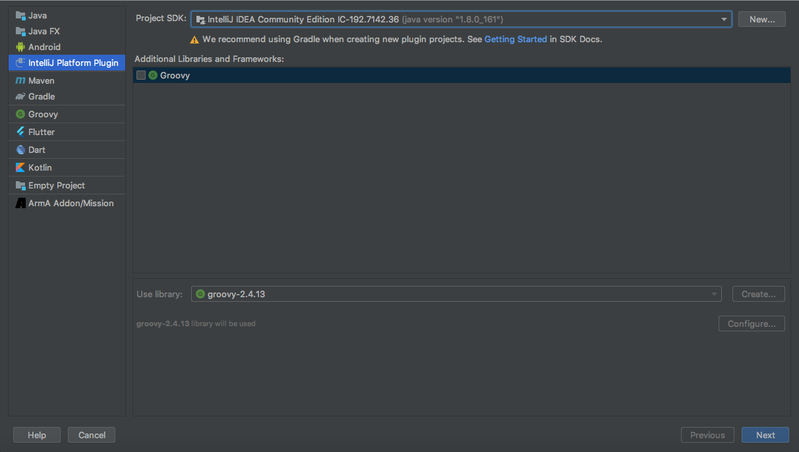

手把手从头开始创建Idea插件
=======

## 目录

[一、准备工作](#first)

[二、创建项目](#second)

[三、编写插件](#third)

[参考](#end)

## 正文

这里使用我自己的例子来创建Idea插件ShellCommand，这是一个用于创建自定义Bash Shell工程的插件。

### 准备工作<a name="first"></a> [^setting_up_environment]

* DevKit

Plugin DevKit是IntelliJ的一个插件，它使用IntelliJ IDEA自己的构建系统来为开发IDEA插件提供支持。开发IDEA插件之前需要安装并启用Plugin DevKit。

打开IDEA，Settings -> Plugins，搜索并安装Plugin DevKit。

* Idea Version

    

### 创建项目<a name="second"></a> [^creating_plugin_project]

* File -> New -> Project
    

    上面这里是之前版本的插件创建习惯，现在官方推荐Gradle的方式创建管理项目 [^with_gralde]

    

* Next 填写项目名完成

    

* 由于某些原因可能会使Gradle同步出现问题，下载失败之类的。[^error_gradle] [^error_download]

    

* 创建完成后项目结构如下（Gradle比之前创建的多了Gradle的相关配置文件）

    ```
    your_project
    ├── build.gradle
    ├── gradle
    │   └── wrapper
    │       ├── gradle-wrapper.jar
    │       └── gradle-wrapper.properties
    ├── gradlew
    ├── gradlew.bat
    ├── settings.gradle
    └── src
        ├── main
        │   ├── java
        │   └── resources
        │       └── META-INF
        │           └── plugin.xml
        └── test
            ├── java
            └── resources
    ```

    

### 编写插件<a name="third"></a>

* 创建ModuleType类

    ```
    public class ShellCommandModuleType extends ModuleType<ShellCommandModuleBuilder> {
        // 自定义ID
        private static final String ID = "SHELL_COMMAND";

        public ShellCommandModuleType() {
            super(ID);
        }

        public static ShellCommandModuleType getInstance() {
            return (ShellCommandModuleType) ModuleTypeManager.getInstance().findByID(ID);
        }

        @NotNull
        @Override
        public ShellCommandModuleBuilder createModuleBuilder() {
            return new ShellCommandModuleBuilder();
        }

        @Nls(capitalization = Nls.Capitalization.Title)
        @NotNull
        @Override
        public String getName() {
            return "ShellCommand"; // 显示在New Project中的名称
        }

        @Nls(capitalization = Nls.Capitalization.Sentence)
        @NotNull
        @Override
        public String getDescription() {
            return "";  // 描述不能为null
        }

        @NotNull
        @Override
        public Icon getNodeIcon(boolean isOpened) {
             return AllIcons.Icon; // 这里还没有设置自己的图标，暂时用系统的代替，否则无法运行
        }
    }
    ```

* 创建ModuleBuilder

    ```
    public class ShellCommandModuleBuilder extends ModuleBuilder {
        @Override
        public ShellCommandModuleType getModuleType() {
            return ShellCommandModuleType.getInstance();
        }
    }
    ```

* 修改plugin.xml, 添加声明

    ```
    <extensions defaultExtensionNs="com.intellij">
        <!-- Add your extensions here -->
        <moduleType id="SHELL_COMMAND" implementationClass="com.wonderingwall.plugin.shellcommand.ShellCommandModuleType"/>
        <moduleBuilder builderClass="com.wonderingwall.plugin.shellcommand.ShellCommandModuleBuilder" id="SHELL_COMMAND" order="first"/>
    </extensions>
    ```

* 先运行下看看效果

    

上面图标是默认的，显得不协调，这需要按照UI设计规范来 [^ui_guidelines]。自己动手丰衣足食，我很久不用photoshop了，开源精神用的就是[GIMP](https://www.gimp.org/)

* Icon文件及目录设置

    

    首先resources目录下创建icons来存放我们的logo图片，其次很重要的，很重要的，很重要的，必须创建icons路径和你的图片加载类

    ```
    public interface SCIcons {
        Icon LOGO_12 = IconLoader.getIcon("/icons/logo_12x12.png");
        Icon LOGO_13 = IconLoader.getIcon("/icons/logo_13x13.png");
        Icon LOGO_16 = IconLoader.getIcon("/icons/logo_16x16.png");
    }
    ```

* 替换Icon回调方法，使用自己的Logo

    ```
    public Icon getNodeIcon(boolean isOpened) {
        return SCIcons.LOGO_12;
    }
    ```

* 运行看结果

    


## 参考<a name="end"></a>

[^setting_up_environment]: [设置开发环境](https://www.jetbrains.org/intellij/sdk/docs/basics/getting_started/setting_up_environment.html)

[^creating_plugin_project]: [官方文档Creating a Plugin Project](https://www.jetbrains.org/intellij/sdk/docs/basics/getting_started/creating_plugin_project.html)

[^with_gralde]: [Learn how to build plugins with Gradle](https://www.jetbrains.org/intellij/sdk/docs/tutorials/build_system.html)

[^error_gradle]: [Gradle项目时下载重复解决](https://intellij-support.jetbrains.com/hc/en-us/community/posts/115000153630-Plugin-gradle-config-building-downloads-the-same-version)

[^error_download]: [下载失败问题](https://github.com/JetBrains/gradle-intellij-plugin/issues/345)

[^ui_guidelines]: [IntelliJ Platform UI Guidelines](https://jetbrains.design/intellij/principles/icons/)
